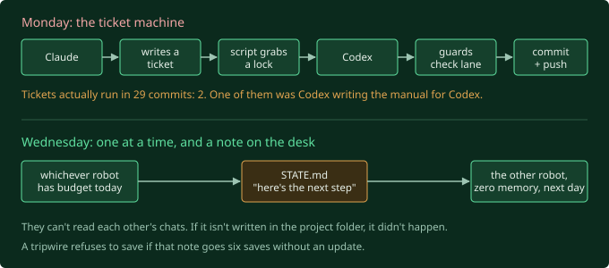

This one isn't about code. If you're building anything with AI right now, you
might have felt some of this too.

## The shame bit

I use AI for pretty much all the heavy lifting here. Not "I asked it a question
once". It reads the decompiled game code next to me, and a lot of the time I'm
just the guy watching it happen.

And there's a wee bit of shame under that. Like I outsourced the thinking.

"Don't use it then." No chance. Watching it chew through 15 MB of compiled
bytecode in an afternoon, work that would have cost me weeks, I'm not handing that
back. The founder of the studio literally told me to use it (post 2). So the real
question is what's left for me to do, and whether that part matters.

The mathematician Terence Tao has a line I picked up from a YouTube video: using
AI is like taking a helicopter to the summit instead of hiking. You get the view,
but you skipped the climb, and the climb is where you'd have got fitter. Next peak
over, you still can't do it on your own.

Real worry. But it assumes there's one summit and everyone knows where it is.
Nobody has revived Fury. The helicopter is fast, but it doesn't know where to fly.
Someone has to read the terrain and point, and someone has to notice when the
pilot says "summit's right there" with total confidence and is aimed at a cloud.
That's me, and there's a lot of it. (Some of it is also literally sitting at the
machine, running a debugger by hand, because the AI doesn't have hands. More on
that in post 16.)

AI is unreasonably good at anything with a checkable answer. Does the client
connect? Does the file decode? It's much weaker at the stuff with no right answer.
What combat should feel like. Which dead end is worth walking into next. So the
split sorts itself out: AI does the archaeology and the plumbing, I own the
direction and, eventually, the feel of the game.

## Hiring a second robot

Then the practical problem. I'm on the cheap Claude plan, about seventeen bucks a
month. That buys a rolling five hour budget and a weekly one, and when you burn
through either, it just stops talking to you for a few hours. It never happens at
a tidy moment. It happens forty minutes into a bug, right when I'm two steps from
the answer.

I've also got a ChatGPT sub, and OpenAI's Codex runs off it. Same kind of tool:
an AI in a terminal that reads and edits your files. So, two robots. When one runs
out, the other keeps going. Obvious, and also the kind of obvious that quietly
wrecks a project if you do it badly.

**The file that was already lying.** Each robot reads a rules file when it starts
up. Claude reads `CLAUDE.md`, Codex reads `AGENTS.md`. I went to write the Codex
one and found it already existed. I hadn't written it. I opened it expecting a
stub.

It was my `CLAUDE.md`, all 835 lines of it, with every "Claude" swapped for
"Codex". Codex's app had "helpfully" imported my other agent's config with a find
and replace, so my rule saying Claude looks after its own session housekeeping now
said Codex did, and a line about running Claude alongside Codex now described
"running Codex + Codex/Astra together". Nobody wrote that. It just appeared, and was
about to become the rules. That setting got switched off about four seconds later.

Also: 835 lines, of which about 740 were a diary of every session I'd ever done,
read by the robot every single time it woke up. Ripped it out. One shared rules
file for both, a tiny Claude only file, and a small `STATE.md` saying where the
work is. `CLAUDE.md` went from 835 lines to 26, and a check now fails if it grows
back, because I know exactly how it got to 835. One useful paragraph at a time.

**Asking the new hire to audit the job offer.** Before building any of it, I
handed my plan to Codex and asked it to tear it apart. It found four real
problems, including that my plan had Codex committing its own work when its
sandbox physically can't, and that my "push if there's anything to push" logic
would have happily published four of my half revised blog posts. Best two minutes
of the day.

Then it told me one rule that was exactly backwards, and I copied it in without
thinking, because it had just been right four times running and I'd stopped
reading properly. A confident correction from an AI that's been right all
afternoon is still just a claim.

**The guards fired on me first.** The safety rails I built caught my own
bookkeeping as an intruder. PowerShell read a file in the wrong encoding and
turned every em dash into `â€"`, on a blog whose hardest rule is that posts
contain no dashes at all. And a harmless git warning killed the run twice right
at the finish line. The robot's bit worked first time. Mine took four goes.

I finished that day by writing, on this very blog, that all this machinery was
"the tax worth paying".

## 48 hours later

It took about two days for that line to age badly. I asked Claude a blunt
question: has any of this actually saved us anything? Then I made it count.

29 commits since Codex joined. **Two tickets.** One of those two tickets was Codex
writing the instructions for how to use Codex. About eight commits went into
building, fixing and documenting the ticket machine itself.

Best bit: the day before, Claude had noticed the queue was basically empty and
written itself a stern note in its own rules file. Word for word: "as of
2026-09-10 it had been used once. Do not let that continue."

It continued.

It wasn't laziness, it was the kind of work. A ticket is for jobs where you
already know the answer and just need someone to type it. The last week has been
hooking into a running game to catch it deciding things. You can't write a work
order for "find out why". And by the time I *do* know the fix, it's two lines,
and writing the ticket takes longer than writing the two lines. The middle manager
spent all its time managing an empty inbox.

So it's gone. No tickets, no lock, no manager. Codex gets promoted from intern to
second shift. Only one robot works at a time, whichever has budget when I sit
down. The catch is they can't see each other's chats, so the handoff lives
entirely in the project folder. `STATE.md` says what to do next, written so a
robot with zero memory of today could start cold, because that's literally what
happens.

Turns out Claude had been quietly breaking that rule too. It has a private memory
feature, and had saved two notes there, one of them a summary of how these posts
should sound. Codex could never see it. Both were copies of stuff already in the
project docs, so they're gone. The checker now refuses to save if `STATE.md`
goes six saves without an update, because a stale note is worse than none: the
next robot will trust it.

Not everything got binned. The short shared rules file and the size limits stay.
The bit that went was the machinery for handing work from one robot to another.

## So, how much of this is me?

More than I thought going in. I pick the direction, call the dead ends, catch the
confident nonsense, run the stuff that needs hands, and (it turns out) fire the
middle management. If a project is deep enough, it doesn't much matter how much
AI you use, because there's still no version of it getting finished without you.

This one seems deep enough to me.
