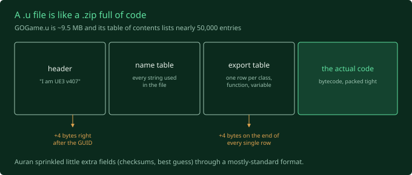
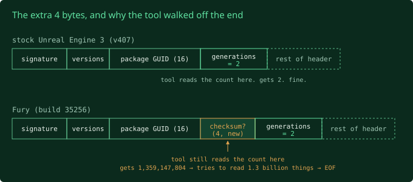
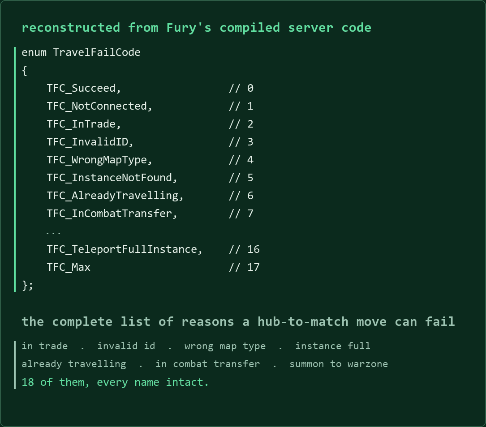
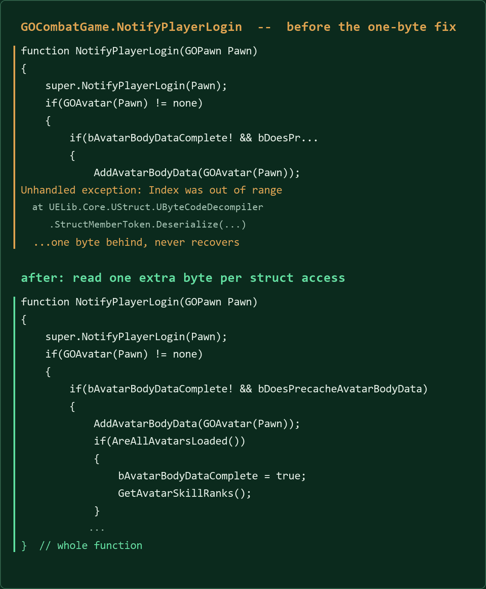
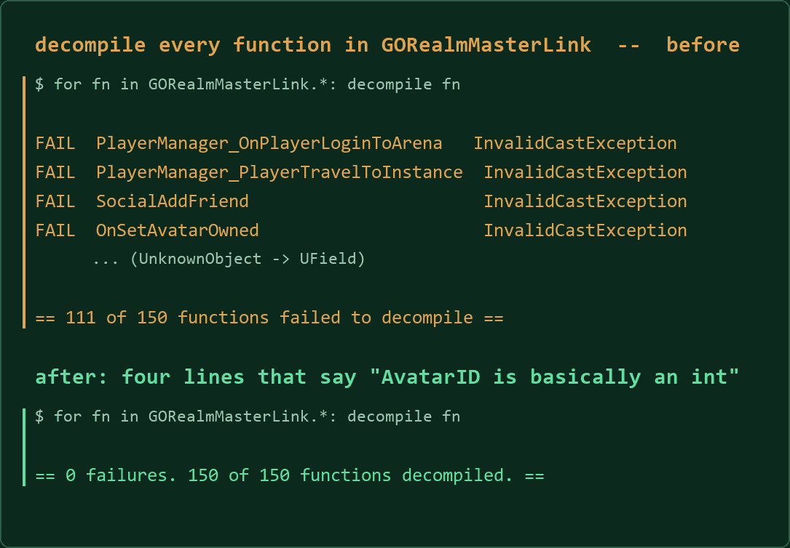
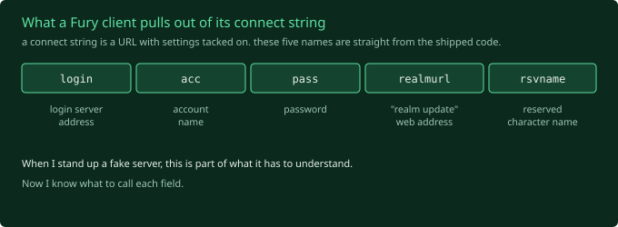

The verdict from the poking phase was "everything runs, and there is no
shortcut". So now I'm into the slow part: taking the game's code, which ships in
a compiled form I can't read, and turning it back into something I can.

That's decompiling.

## The shape of the problem

Unreal games from this era ship their gameplay code as `.u` files. Think of one
like a `.zip` full of code: a header describing what's inside, a big table of
contents, then the contents. Fury has fourteen of them. The big one, `GOGame.u`,
is about 9.5 MB and its table of contents lists nearly 50,000 entries.



The tool I'm using is called UELib (with a viewer on top called UE Explorer). It
supports dozens of games. It does not support Fury, because until now nobody had
a reason to point it at Fury.

## First run

```
Package Version: 407/36
Build: Unknown
Generations Count: 1359147804
Unhandled exception: Unable to read beyond the end of the stream
```

`407/36` is the tool correctly reading Fury's "I am this exact flavour of Unreal"
stamp. `Build: Unknown` means it's guessing. Then it reads a number that should be
about 2, gets 1.3 billion, tries to read 1.3 billion things, and runs off the end
of the file. Ambitious.

That 1.3 billion isn't random garbage. It's four bytes Auran added to the file
format that stock Unreal doesn't have, being read as if they were the next real
field. Everything after that point is off by four bytes.



So I registered Fury as a known build (`407/36`) with one instruction: right
after the unique ID, read four extra bytes and throw them away. Rebuild. The
header parses, and the mystery value comes out as `0x78605B61`, which is exactly
the value an earlier audit had written down for this file. Two different methods
agreeing means I'm reading the format right, not just moving the crash around.

The crash did move around, though. Next one was in the table of contents, where
name lookups pointed off the end of the name list. I dropped out of the decompiler
and wrote forty lines of Python to read the table by hand, trying different guesses
about the layout. The one that worked: stock layout, **plus four extra bytes on the
end of every single entry.** With that, every entry lines up and the table ends
exactly where the header said it would, to the byte.

Rebuild. Run again. And this time:

```
enum TravelFailCode
{
    TFC_Succeed,              // 0
    TFC_NotConnected,         // 1
    TFC_InTrade,              // 2
    TFC_InvalidID,            // 3
    TFC_WrongMapType,         // 4
    TFC_InstanceNotFound,     // 5
    TFC_AlreadyTravelling,    // 6
    TFC_InCombatTransfer,     // 7
    ...
    TFC_TeleportFullInstance, // 16
    TFC_Max                   // 17
};
```

That's real Fury source code, rebuilt from the compiled file. Yozza. An `enum` is
just a named list of possibilities, and this one is every reason the game can give
for why moving you from the social hub into a match might fail. "You are in a
trade." "That instance is full." "You are already travelling."



There's a bigger one, `PerformanceType`, 104 entries long, that reads like a tour
of the whole backend. Login queue size. Logins per second. Players in matchmaking
per mode. Billing purchases in the last minute, five minutes, hour. Three
different skill rating systems: `Glicko`, `TrueSkill`, and something Auran called
`Whippy`. Like Mr. Whippy?? Kiwis, Brits and Aussies know.

I sat there reading server telemetry counter names for a game that hasn't had a
running server in sixteen years. Good moment.

## One byte

Enums are the easy case. The real prize is functions, the actual logic. Simple
functions came out fine. Anything that did something real came out half finished
with an error in the middle.

Compiled code is a stream of tiny instructions packed end to end with no padding.
To read instruction five you have to have read one through four at *exactly* the
right length, because that's the only thing telling you where five starts. Get one
length wrong by one byte and everything after it is nonsense.

So I picked one broken function, found its raw bytes, and walked them by hand,
instruction by instruction, next to what the tool thought it was reading. About
thirty instructions in, we disagreed. The instruction for "read a field out of a
struct" is one byte longer in Fury than in stock Unreal. Auran added a flag to it.

One byte. One line of code to tell the tool. And out came this:



That's a real function off Fury's match server, the code that runs when a player
joins a fight. The thing that worked was the least clever option available: print
the raw bytes, get a pen, and walk them until the tool and I disagreed. Half an
hour with a pen beat a day of reading the code around it.

## Eight out of ten, which was a lie

I spot checked ten functions. Eight came out whole. I called that a win and went
to bed.

Next morning I wrote a batch runner to dump *everything* to disk, and pointed it
at the one class I care about most: `GORealmMasterLink`, the client's phone line
to the master server. Matchmaking, chat, guilds, who's online, shoving you from
the hub into a match. 150 functions in it.

**111 of them crashed.** All with the same "UnknownObject" error.

Turned out Auran gave themselves custom variable types. In most code a player ID
and a team ID are both just numbers, and nothing stops you passing one where the
other belongs. Auran made `AvatarID`, `TeamID`, `GroupID` and `GuildID` their own
types. Under the hood each is still an integer, but the compiler treats them as
different things. Tidy engineering, and I'd bet it caught real bugs. The
decompiler had never heard of any of them.

The fix: "when you see these four, treat them like an `int`." Four lines.



My hand picked sample of ten sailed straight past the class that was 74% broken.
Lesson: dump everything, then read the failure log. The failure log is where the
truth is.

## Everything was shouting numbers at me

With the classes decompiling, the contents still read like this:

```
reservedName = __NFUN_201__(reservedName, "_", " ");
__NFUN_231__(__NFUN_168__("Login server address =", Address));
```

`__NFUN_231__` is the tool saying "there's a call to built in function number 231
and I don't know its name". The names live in the *other* `.u` files, which the
tool never opened. So I taught it to peek at its siblings first:

```
reservedName = Repl(reservedName, "_", " ");
LogInternal("Login server address =" @ Address $ ", Account name =" @ userName);
```

Real code.

## The payoff

All fourteen files, about **2,000 classes**, on disk. And useful things fell out
straight away. Here's the client pulling values out of the address it connects
with:



Grepping the lot turned up 56 database operations called by name, and the names
aren't shy: `AVA_GetAvatarByName`, `EQU_GenerateLootItem`,
`SVR_BanPlayerByAvatarName`. I don't have the database, but I have the list of
questions it was expected to answer.

And I found the bouncer. Before you connect to a match, the master server tells
the match server "expect a player with this session key". You connect, present
the key, and either you're on the list or you get kicked with `WRONGSID`.


## The pattern

Every single thing Auran changed about this engine's file format has been small,
local and the same shape: one extra field, tucked into an otherwise standard
structure. Five surprises now, five one liners. None of them needed a rethink.
Every one announced itself as a crash or a number off by a few bytes.

Honest bit: it isn't spotless. About seventy classes, almost all graphics and
menu stuff, come out with their default settings block cut short. It doesn't
touch a line of logic and none of it is server code, so it's parked.

Next: actually read the thing.
