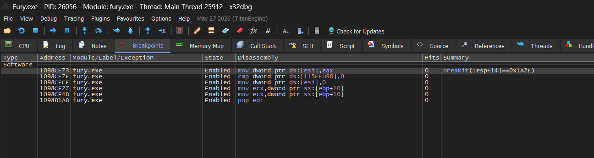
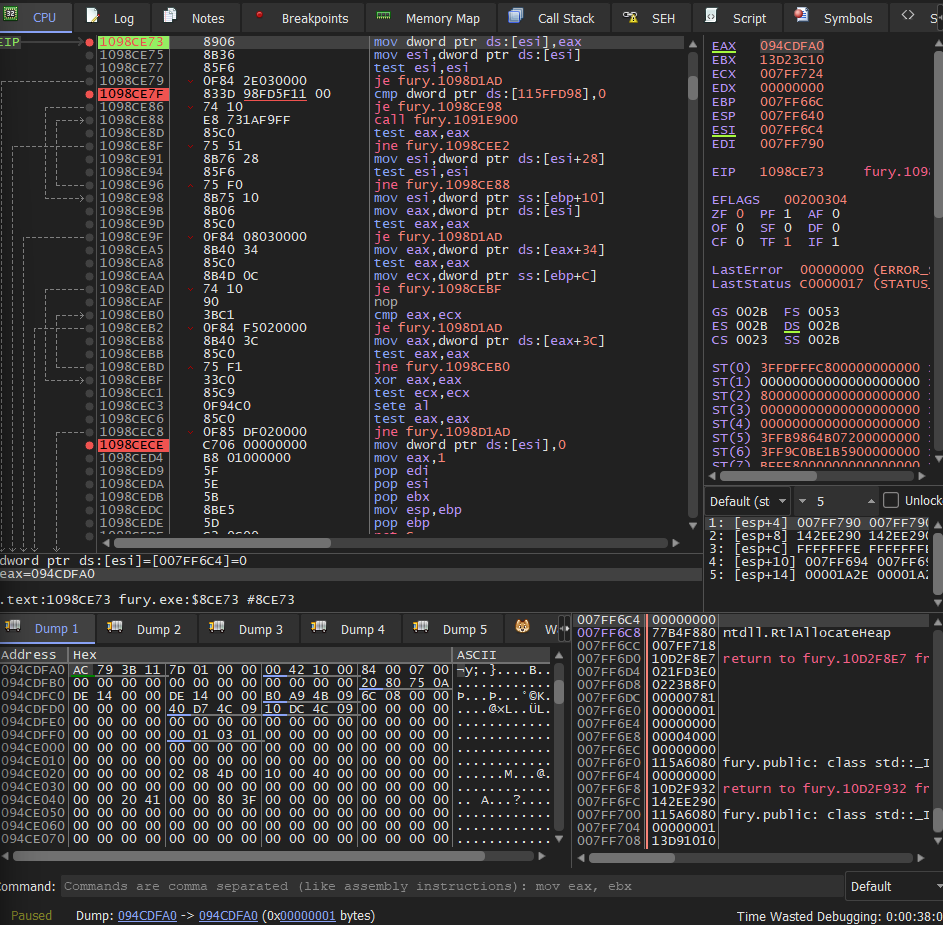
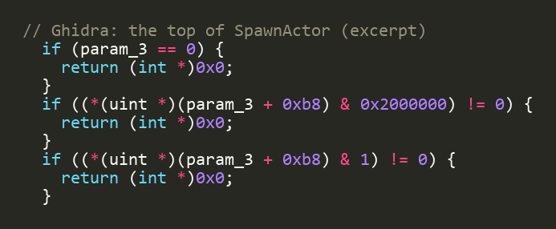
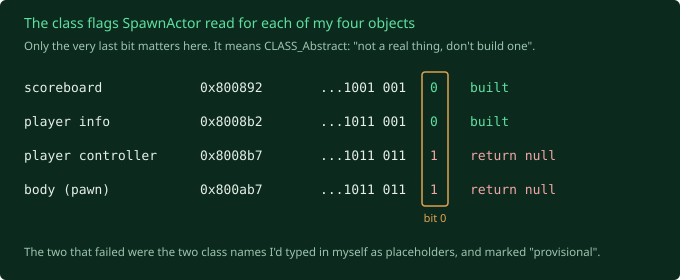

Everything I could check by reading, I'd checked (post 15). The last question,
what the client actually *does* with my number while it runs, needs a debugger on
the live game. A debugger lets you freeze a running program at any instruction
and look inside it: every register, every byte of memory.

The AI can write the instructions, but it doesn't have hands. A debugger with
buttons needs someone at the keyboard, so for this one it had to be me, sitting
at my own PC, pressing F9.

## Setting the trap

The tool is x32dbg. The good news: Fury's client is a
32 bit program from 2008 with a fixed load address and no address randomisation.
Modern programs shuffle themselves around in memory every run as a security
measure. Fury doesn't know that's a thing. So the addresses from the Ghidra work
are the exact addresses at runtime. Type one in, get a breakpoint on the right
instruction. Easiest possible case, for once.



The lookup function runs thousands of times a second for everything in the game,
so a plain breakpoint would stop constantly. The trick is a condition: only stop
when the number being looked up is my scoreboard.

![The breakpoint condition: [esp+14]==0x1A2E. 0x1A2E is 6702 in hexadecimal, the scoreboard's number from post 15. "Only stop when the client is looking up my scoreboard."](x32dbg-breakpoint-condition.png)

Then run the client, let it connect and do the whole handshake, and wait.

## It hit



What that screen said, in order:

**The lookup returns a real object.** The register holding the result (EAX, top
right) isn't zero. So the client's file list is fine and the lookup works.

**It's exactly the right object.** I followed the pointer to the object's class,
and it's the scoreboard's class, from exactly the slot my second reader in post 15
said it would be. Correct object, nothing else.

**The sixteen is real, and the client fixes it.** The object's own number in
memory reads `5342`, not the `5326` stored in the file. The client renumbers
objects to their table position when it loads a file. So post 15's fix was right,
and the old number could never have worked.

**Both checks pass.** Including the "is it on the map's list" gate, which takes
the exact early exit I predicted.

Five posts of theories about this one function, cleared in one run. It's
innocent. It reads the number, resolves the right object, passes every check, and
hands it back. The bug is in whatever called it.

I should have done this three posts earlier. The cost of a debugger run is me at a
keyboard for fifteen minutes. The cost of guessing wrong is a whole post.

## Four ways to say nothing

The caller is the function that's supposed to take that object and actually spawn
it into the world. It's about 2,400 bytes of machine code, and I expected to find
the one check that rejects my scoreboard.

There is no one check. There are **eight** places it can quit early, and every
single one jumps to the same address, `0x10B3EA56`. Three instructions: tidy up,
return. No error, no log, nothing back to the server. That's the silence I've been
describing since post 10, as an actual address.

Three I could rule out by reading. That left four suspects. The obvious one, "the
spawn call returned nothing", I chased through every path in the engine's
`SpawnActor` that returns null. Nine of them. Every one was either impossible for a
scoreboard or switched off by the flags the caller passes. Ruled out, on paper.
(Keep that "on paper" in mind.)

## The debugger that runs itself

The plan was another debugger session with four breakpoints. Then I wanted to go
out for the day and keep this moving from my phone, which rules out sitting at
x32dbg. So: could the run happen without me?

It could. **Frida** injects into a running program and lets a script do what I'd
been doing with buttons: hook any address, read registers, read memory. And
because Fury never moves around in memory, a hook is just "attach here", with the
number straight off the Ghidra map. One Python script now starts my server,
launches the client with the hooks attached, runs the handshake, prints what
fired, and kills both. Fifteen seconds, no windows, no me.

I got greedy and watched all four objects at once. Result, four runs in a row:
the scoreboard and the player info go all the way through to the success exit.
The player controller and the body walk in, and walk straight back out the silent
door.

For about ten minutes I also thought I'd found a real crash, until I worked out I'd
packed four hooks into eleven bytes of code. Each hook needs five bytes, so they
were stamping on each other. Every hook is a tiny edit to the running program, and
enough tiny edits in one spot is a bug you made yourself. Foreshadowing.

## Bracketing the spawn

Hooks spread across the spawn half this time. All four objects pass the early
checks. All four take the "spawn a new one" branch. Then the spawn call itself:

The scoreboard gets back a freshly built object. The player info too. **The
controller and the body get back zero.**

So the spawn call *does* return nothing. The one I ruled out on paper. Inside
`SpawnActor`, right at the top, there's a little gate of quick checks on the class
you asked it to build:



That last one. I hooked it and read the flags for all four:



The last bit is `CLASS_Abstract`. "This is a template for other classes, not a real
thing. Don't build one." My paper analysis had quietly assumed the class was a
normal, buildable one. It wasn't.

## The one line grep

At this point I did the thing I should have done ten days earlier, and opened the
decompiled source for the two classes my server was sending:

```
class GODynamicPlayerController extends GOPlayerController
    abstract
    native
    ...

class GOPawn extends GOStitchedPawn
    abstract
    native
    ...
```

`abstract`, right there in the header. I'd been handing the client a blueprint
stamped "not a real thing" and asking it to build a player out of it.

And here's the bit that stings. Those two class names were **placeholders**. I put
them in when I first stubbed out the object set, with a comment that said, more or
less, "provisional, the real ones are whatever the arena game class declares". Then
I spent about ten days debugging index maths and file lists and a live debugger,
several layers downstream of a value I had personally labelled as a guess.

The real classes took thirty seconds to find. The arena's game class names them:

```
DefaultPawnClass=Class'GOGame.GOCombatAvatar'
PlayerControllerClass=Class'GOGame.GOCombatPlayerController'
```

Two strings changed. Same script:

```
actor channel 1 <- GRI  (GameReplicationInfo)      spawned, success exit
actor channel 2 <- PRI  (PlayerReplicationInfo)    spawned, success exit
actor channel 3 <- PC   (GOCombatPlayerController) spawned, success exit
actor channel 4 <- Pawn (GOCombatAvatar)           spawned, success exit
```

All four. The first time the whole set has landed on the client.

## Lessons, both cheap

"Ruled out" was a paper reading with an assumption buried in it. The first time a
real value went through the real function, the assumption fell over. Three short
Frida runs took the bug from "somewhere in the property loop" to "the spawn returns
null" to "the class is abstract" to a grep.

The cheaper lesson: when something is marked provisional, that's the first thing
to nail down, not the last. I had a note telling me exactly where the right answer
was. I just found the downstream stuff more interesting to poke.

The script kills the client fifteen seconds after the objects land, before it
draws a frame. So I still don't know what it does with them. Surely a character
is standing in the arena now.
