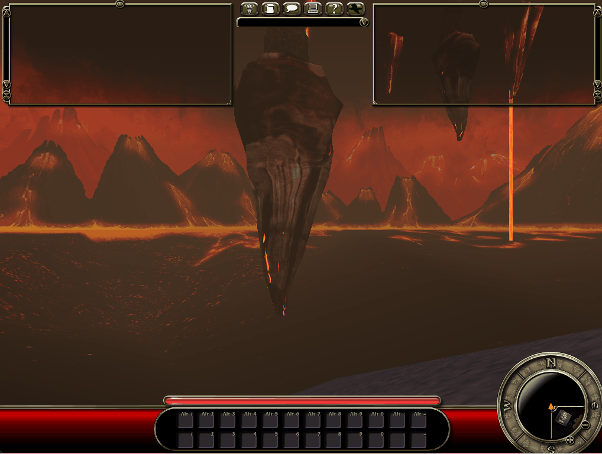
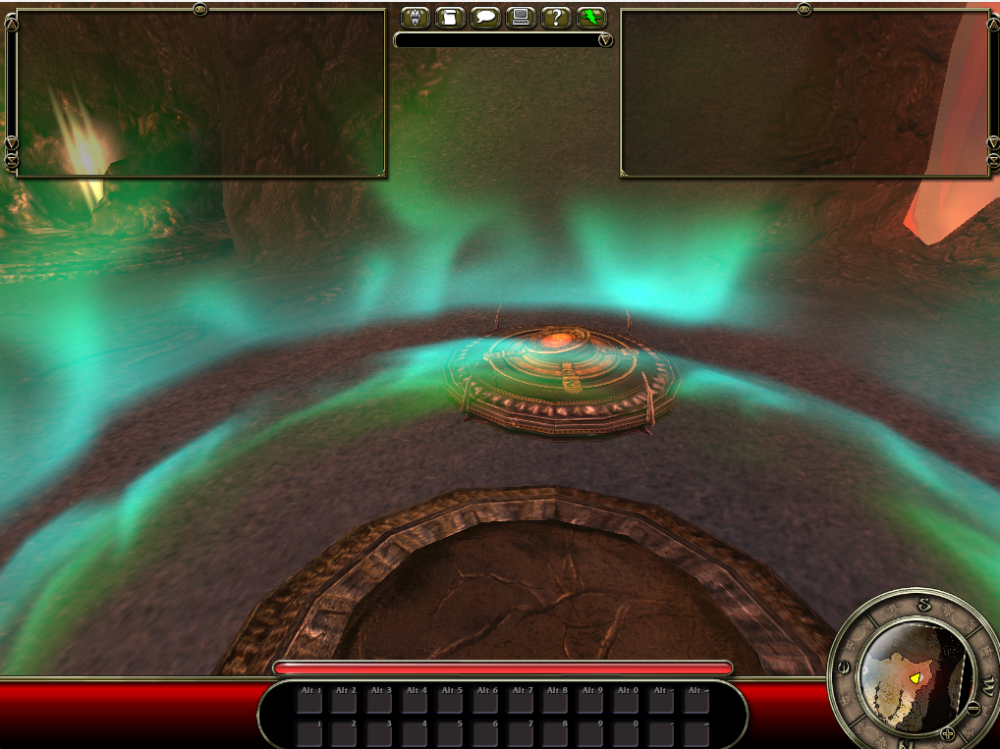
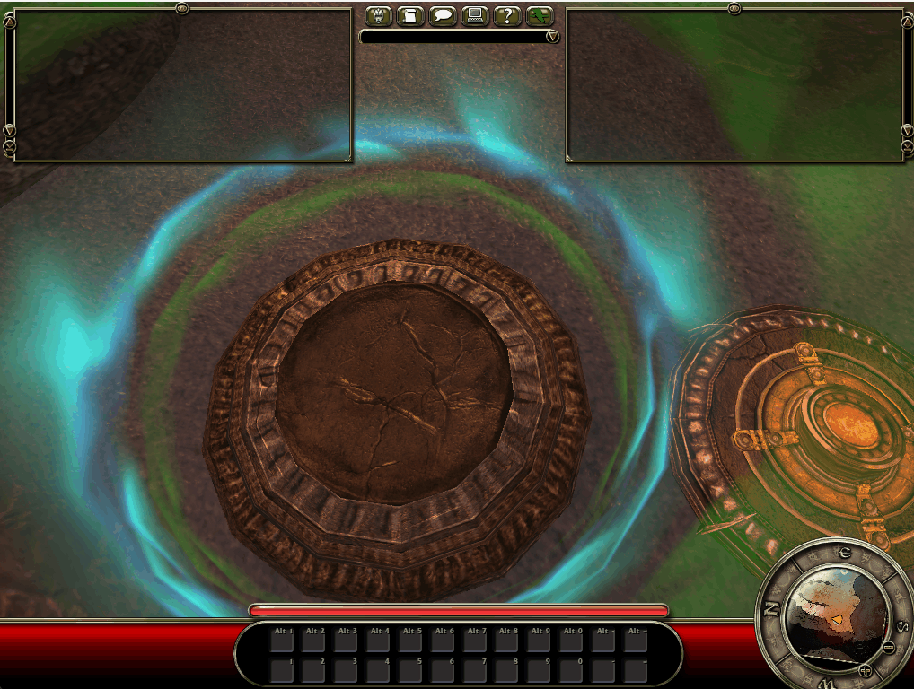

Last post I found out why the game was yelling "Connection Interrupted" at me:
my server never told the client what time it was, so its own internal clock
drifted off and tripped an alarm. Two things left over from that: a small fix
(figure out how the game actually writes a number called a "double" onto the
wire), and a much bigger, older question that's been sitting in my notes for a
couple of sessions now: why does the client never tell my server it's done
loading?

## The small one: teaching the wire a new number

Every value the game sends over the network gets packed into bits by a specific
bit of game engine code, one function per data type. I'd already figured out
how it does whole numbers and normal decimals (the ones programmers call
"floats"). But the exact number I needed for the clock fix is a "double", a
wider, more precise decimal, and I'd never seen the game write one of those
before. Rule I set myself ages ago: never guess a wire format, go and read the
actual compiled code that does it.

So I did. I pointed Ghidra (a free tool that turns compiled game code back into
readable, C-like pseudocode) at the exact function, and it turned out to be
almost insultingly simple: it's the *identical* code to the float version,
byte for byte, except one instruction changed from "copy 4 bytes" to "copy 8
bytes". No trickery, no downcasting to save space. I wrote the C# to match,
round-tripped a pile of test values through it (including the classic
double-precision troublemakers, `double.Epsilon`, `MinValue`, `MaxValue`) and
checked the raw bytes matched what .NET's own number library would produce.
All green.

Wired it into the server on a repeating timer (the game's own script re-arms
this every 15 seconds, so I copied that), ran it against the real client, and
watched my own log line go out:

```
actor channel 3 (PC): sent RPC ClientSetServerTime(DoubleValue { Value = 83.828 }, ...)
```

Small, satisfying fix. On with the actual mystery.

## The bigger one: a message that's been going missing for two sessions

Quick recap for anyone just joining: the game world now genuinely loads. The
loading screen drops, the arena renders, my character's HUD comes up. But the
instant that happens, the game is *supposed* to send one particular message
back to the server, basically "hey, I'm done loading, loading screen's gone."
It never arrives. I've known this for a couple of sessions and each time I've
written "not chased yet" and moved on to something more tractable.

Not this time. Here's the thing that made it worth cracking open: there is
exactly **one** function, in the entire multi-megabyte client executable, that
actually puts a reliable message onto the wire. Every single kind of network
traffic (chat, replicated data, remote function calls, all of it) funnels
through this one piece of code before it ever touches a socket. If I hook that
one function, I *cannot* miss the message, no matter which weird code path it
takes to get there.

So that's what I did. I wrote a script that attaches to the running client (via
Frida, a tool for injecting your own code into somebody else's already-running
program) and hooks that one send function, logging every single call it gets
plus a full stack trace of who called it. Then I ran a real session: server up,
client spawned, held it open for ninety seconds after the loading screen
dropped.

Result: 26 calls right at the start (the normal handshake chatter), then
**nothing**. Not one more call to that function for the entire ninety seconds,
right up until I forced the client to close and it sent one final "I'm
disconnecting" message on its way out. The client's own log file confirms it
genuinely did finish loading a few seconds in ("OnLoadingCompleteCheck",
"DisableLoadingScreen> 1"), and then it just... sat there. Fully rendered,
fully idle, saying nothing.

## What that actually rules out

Going in, my leading theory was that the "I'm done loading" call was sneaking
out through some other, harder-to-see path, maybe through a virtual function
table lookup that my earlier static analysis (reading the disassembly cold,
without running anything) couldn't trace back to its caller. That would've
been a real headache: it'd mean the call *was* leaving, just via a route I
hadn't found yet.

This experiment kills that theory outright. Since the hook sits on the actual
function body, it doesn't matter how the call gets there, direct call, virtual
dispatch, whatever. If the message left the process, I would have seen it. It
didn't. Which means the call isn't going missing on the way out: **something
is stopping it from being sent in the first place**, before it ever gets
anywhere near the networking code.

That's actually good news, in the annoying-progress kind of way. It narrows the
search from "somewhere in a massive networking stack" down to "somewhere in how
this one game object decides whether it's allowed to talk to the server at
all". My money's on something in how my shortcut version of the server sets up
that object not quite matching what a real server would do, so the client's own
bookkeeping doesn't think it has anywhere to send the message to. Next step is
to catch the object red-handed at the exact moment it tries, and read its own
fields to see what it thinks is missing.

## Catching it red-handed

So that was the plan: catch the object at the exact moment it decides not to
send anything, and read its own fields to see what it thinks is wrong.

First problem, I didn't actually know which of the game's thousands of live
objects to read, or where in memory to find the one field I cared about
("who's my controller"). Games don't ship with a helpful map saying "this
byte means that". I had to build a small tool that walks the game's own
internal bookkeeping, the same lookup table the game itself uses to figure
out which byte means what, and ask it "where does the property called
Controller live on this particular object".

I built it, ran it, and it told me it couldn't find the field at all. Not "the
field is empty", genuinely "I searched and there's nothing here called
Controller". That's the kind of result that should make you suspicious of
your own tool before you get excited about what it's telling you, so I added
a sanity check: ask the same tool to find a *different* field I already knew
the answer to from earlier work. It failed that one too, in a suspicious way
(the same object kept reporting the exact same number of fields at six
different, genuinely different points in its family tree, which isn't how
real data behaves). So the tool was lying to me. Good thing I checked.

Rather than debug that approach further, I switched to a technique from two
sessions ago that I already knew worked: instead of walking the game's static
blueprint of a class, watch the *live* lookup the game itself performs while
it's actually receiving data over the network, and borrow the answer it comes
up with. Same sanity check against the field I already knew, and this time it
came back exactly right.

With a trustworthy way to find the field, I read it, twice, on two separate
runs of the game. Both times: the field isn't empty. My leading theory was
dead on arrival, the "who's my controller" question, which I'd worried might
be pointing at nothing and crashing the function silently, genuinely has an
answer.

But then I read the two fields sitting right next to it, and this is where it
gets strange. Every actor in this game engine carries two flags that answer
"who's actually in charge of me, the server or the client I'm running on".
For the game's own controller, on the client's own screen, both of those
flags say "the server". Both of them. On the client. About its own local
copy of the thing it's supposedly a client's-eye view of.

That shouldn't happen, or at least, it doesn't match either of the two ways
I'd have expected it to go wrong. And there's a good reason to think it
matters: if this game object genuinely believes it already has full server
authority over itself, it would have no reason to ask permission before
doing something, which is exactly what "send a message asking the server to
acknowledge I'm done loading" is. It would just quietly do the thing locally
and never bother the network at all. That would explain the silence
perfectly. It's not proof yet, but it's the first theory this session that
actually fits every single piece of evidence I've collected so far.

## Where this leaves things

Clock's fixed (pending one more live check that the banner actually stays
gone). The bigger blocker, the one standing between "the arena renders" and
"I can actually move my character", took two real steps forward today: one
dead theory buried with actual evidence instead of a guess, and one new,
genuinely strange clue that fits everything I know so far. Still unresolved.
Next job is figuring out exactly where in the handoff from server to client
those two "who's in charge" flags are supposed to flip, and whether my
server needs to hand them over already flipped instead of trusting the
client to do it.

## Chasing the flags, and finding something else entirely

So that was the plan. I had a specific, concrete idea of *how* those two
flags might end up both saying "the server": my earlier reading said the
client applies a batch of properties one at a time, in a fixed order, and if
it stops partway through that batch for the controller object specifically,
it would land on exactly the wrong pair of values by accident. There's a
single spot in the client's code that would cause exactly that kind of
partial stop, and this time I could actually watch it happen live instead of
reading cold disassembly and guessing.

I hooked that one spot, both the check itself and the place execution lands
if it fires, and ran a full session: server up, client spawned, all four of
my game objects opened and replicated, right through the loading screen
drop. Then I watched the hook trace.

It never fired. Not once, on any of the four objects, across their opening
messages or their follow up updates. Clean theory, wrong theory. That's the
second dead end this thread has produced, and honestly the more satisfying
kind: I built the exact instrument needed to catch it red-handed, and it
came back with a clear no instead of an ambiguous maybe.

But watching that same trace turned up something I wasn't looking for. Three
of my four game objects (the two scoreboard style ones and my character's
body) each send exactly the two values I told the server to send for them,
and the client applies both, cleanly, every time. My player controller, the
one object at the centre of this whole mystery, sends the same two values
but the client only ever applies **one** of them. Not "applies the wrong
one", not "crashes", just quietly stops after the first and moves on to the
next message like nothing's missing.

That's new, and it's specific to exactly the one object I already suspected.
It also means my "both flags happen to end up on the wrong values by
accident" theory can't be the *whole* story either, since the mechanism I
thought would cause that never runs. Something earlier in the pipeline, the
part that turns a raw number on the wire into "this is property number 18,
the Role field" is where I need to look next: whether the number I'm sending
even survives to that point unchanged for this one particular, unusually
large object.

## Where this actually leaves things

Two theories down today, not one, and the search area is smaller and
stranger each time: it's not the loading screen logic, it's not this
particular truncation check, it's something upstream of both, and it only
shows up on the one object with the longest family tree of the four. Next
job: catch the raw number as it comes off the wire for that specific message,
before anything tries to look up what it means, and see whether it's already
wrong by the time it gets there.

## Hand-decoding the whole message, bit by bit

So that's what I did, the slow way: I took the exact raw bytes for my player
controller's very first message and decoded every single bit of it by hand,
against my own written spec for how each piece is supposed to be packed.
Tedious, but it can't lie to me the way a half-trusted tool can.

The first forty three bits matched my spec exactly: an identifier for which
object this message is about, then a compressed 3D position. Good, that part
of my understanding is solid. Then came the two values I'd been chasing:
first the "who's in charge" field again (nine bits saying which property this
is, then some number of bits for the actual answer), then, immediately after
it, the second field.

Here's the catch. That "some number of bits" isn't fixed. It depends on how
many possible answers the field has. For this particular field there are
four real answers ("nobody", "the server", "a remote copy", "the local
player"), so I'd assumed three bits worth of room, since three bits can count
up to eight and the game's own compiler, I knew, quietly adds one extra,
unused placeholder answer to every list like this, making five entries
total, and I was rounding up from five.

My server was sending three bits. When I read what the client actually
consumed, bit by bit, it only ever took two. One bit short. And that missing
bit doesn't just vanish, it becomes the first bit of the *next* thing the
client reads, the identifier for the second field. Every single bit after
that point is shifted one place to the left. I checked the exact number that
produces: the second field's identifier is supposed to be 19, and shift it
left by one bit and you get 38. That's the number I'd been seeing in every
failed decode for two sessions. Not a coincidence, not a rounding error, the
exact fingerprint a one-bit-too-narrow field leaves on everything that comes
after it.

## Finding out why the field is one bit too narrow

Knowing the field was one bit short is not the same as knowing why. My own
notes, and the game's own diagnostic tool that I'd built earlier, both
agreed: five possible answers (four real ones plus the compiler's silent
placeholder) should need three bits. So either my count of five was wrong,
or the rule "count every possible answer, including the placeholder" was
wrong.

First I checked the count itself, no assumptions. I wrote a small tool that
walks every one of the eleven compiled script files the game loads and lists
every single place any of them defines something with this field's exact
name, in case two different files define two different, unrelated things
that happen to share a name and the game was quietly picking the wrong one.
There is exactly one. Five entries, in the one file I expected. That theory's
dead.

So the rule itself had to be wrong, and the only way to know for sure was to
go back to the actual compiled game code and read, instruction by instruction,
what it does. I pointed my disassembler at the exact function that decides
how many bits a field like this gets, and there it was: right before it works
out the bit count, it takes the count of five and subtracts one, every time,
no exceptions. Then it does the "how many bits to fit this many values" math
on *that* number, four, not five.

Four values need two bits. That's it. That's the whole bug. The placeholder
answer the compiler adds gets counted for bookkeeping purposes, but the game
never actually sends it as a real answer over the network, so it never
budgets wire space for it at all. My spec had the right idea (count the
placeholder) but the wrong conclusion (give it room on the wire too).

I fixed the one line of code that had it wrong, reran my full test suite (it
now checks the corrected rule instead of the old broken one), and recomputed
that same player controller message by hand: 43 bits for the position, 11
bits for each of the two fields I'd been chasing, forty three plus eleven
plus eleven, sixty five bits total. Which is exactly the number my earlier
hand-decode said the whole message needed to add up cleanly. Three completely
separate checks (the shipped game files, a live recording of the real
client reading real bits, and the compiled code itself) all agree on the
same two-bit answer. I'm about as sure of this one as reverse engineering
ever lets you be.

## Where this leaves things

The immediate mystery that kicked off this whole thread, "why does the
client never say it's done loading", isn't confirmed fixed yet; that needs
one more live run against the real client to watch it actually recover past
this fix. But the specific, reproducible bug this thread turned up along the
way is fixed and proven consistent on paper. Next job: run it live and watch
whether that missing message finally shows up.

## Running it live, and a decoy

Ran it live. The two-bit fix held up exactly as the paper math said it
would: every message decoded clean, on all four of my game objects, with
zero of the "stopped partway through" breaks I'd been chasing for a week.
Nice. And as a bonus, that same fix quietly cured the "who's in charge" field
too, the one that was reading "the server" on both sides of itself. It was
never a separate bug. It was one property landing on the truncated side of
the exact same two-bit cut, every time.

Which meant I got to cross a theory off the list, except it was the wrong
one to cross off. My leading suspect for "why won't the client tell me it's
done loading" had been: it thinks it already has full authority over itself,
so why would it ask permission for anything. Fixed the field. Watched it
read the correct values this time. The client still never sent the message.
Dead theory, in the most annoying way a theory can die: it was real, it was
wrong on the wire, fixing it was worth doing on its own merits, and it had
nothing to do with the thing I actually wanted fixed.

## The one function that can't lie to me

Back to the drawing board, except this time with a much better tool than
last week. There is exactly one function, out of the entire client
executable, that decides whether a script call to another object runs
straight away on your own machine or gets shipped off to the server instead.
Every "hey, do this thing" message in the entire game funnels through it.
Hook that one, and it doesn't matter how weird the path getting there is,
you catch it.

I'd actually found this function two weeks ago and misread what it did,
mistook a completely unrelated bit of bookkeeping code sitting in the same
neighbourhood for it. This time I went back and found the real one by a
trick I like more each time I use it: instead of guessing which function
does what from a string it happens to print, I diff two objects' entire
lists of internal functions against each other and see what's actually
*different* between them. My message-sending object has ninety extra
functions the generic base object doesn't. One of those ninety, and only
one, contains this exact sentence, baked right into the compiled code as an
error message nobody's ever meant to see: "received script function call
for object not correctly attached to world, ignoring". That's not a guess.
That's the function introducing itself.

Read what it actually does, instruction by instruction, and near the top
there's a check on one single thing: what does the object making this call
believe about its own authority. If it thinks it's "the server", the
function takes a special detour meant for split-screen and demo-recording
edge cases, checks two extra conditions that are never true in a normal
single-player-looking-at-a-server session, and quietly returns having done
nothing at all. Any other belief about its own authority, and it skips that
detour entirely and just sends the message.

Which is exactly the flag I fixed two sections ago. Except I fixed the
*bug* in how it was decoded, not the *value* my own server was choosing to
send in the first place. My server was telling my own player's controller
"you have full server authority over yourself", because that's genuinely
what the server object looks like from the server's own point of view, and
I'd assumed the client's own startup logic would sort out the perspective
flip on its own. It doesn't. That flip only happens once, before any of the
actual values arrive over the wire, and then those values just overwrite
whatever it produced. Whatever I send is what the client ends up believing,
full stop. A real server sends its own player's own controller a swapped
pair of these two flags, specifically because of that overwrite, and I was
sending the unswapped one.

Two lines of code, swap which value goes out for which flag, just for your
own controller specifically. Rebuilt, ran it live: that exact function now
fires for the exact message I've been chasing since post 19, and it returns
"handled" instead of doing nothing. Traffic that used to be a flat line
after the first second turned into a steady stream, thousands of messages
over a forty second hold, roughly one every few milliseconds, which is
suspiciously close to "once a frame". I haven't decoded what's actually in
them yet. But something my client believed about itself was wrong for two
weeks, I found the one line that mattered, and the silence is over.

## The flood has a name

Left that thousands-of-messages-a-second flood as an open question. Went and
answered it properly instead of guessing: wrote a little script that reads the
raw bytes of a captured session and looks up each message's number against a
list of every function the game's own compiled script knows about, so it can
tell me "number 50 means this one" instead of me making that up. Important
bit: it pulls that list fresh every time instead of using one I wrote down by
hand weeks ago, because I already had one of those lying around from an
earlier session and it was wrong, quietly, in a way that would have relabelled
everything if I'd trusted it. The numbers move every time I fix something
upstream. Lesson noted.

Pointed the fixed version at the exact capture from the fix above: 2288
messages, and 2279 of them are the same thing, a function called
DualServerMove. That's the client saying "here's where I'm trying to go,"
sent twice over for reliability, because it's never once heard back from
anything it's sent, which tracks, because my server doesn't listen to any of
this yet. It just lets the shouting land in a bin.

## Where this actually leaves things

Three separate bugs in this one thread, and only the last one was the thing
I originally went looking for. The wire fix from two sections ago was real
and worth doing. The "who's in charge" flag was a genuine symptom of it, not
a separate mystery, even though chasing it as one taught me things I needed
anyway. And the actual answer to "why won't it tell me it's done loading"
turned out to be one wrong value, sent because I assumed a piece of the
client's startup logic would do more than it actually does.

Not calling this one done yet. I've got wire-level proof the message goes
out, the client's own network layer treats it as sent, and now a name for what
it's saying every frame after that. What I still haven't done is watch my own
character actually move on screen, which is the whole point of any of this.
That's the next live check.

## The next live check, and I fell through the world

So I did the live check. Sat there and watched my own client connect to my
own server, and the camera just kept falling. No ground, no floor, nothing
below me, just falling in silence for a couple of minutes while the map got
smaller and smaller behind me.



Turned out to be my own fault, and a dumb one. Weeks ago, when I first got a
character-shaped thing onto the server's books at all, I had to tell the
client *where* to put it, and I didn't have a real answer for that yet, so I
typed in zero, zero, zero and told myself I'd come back to it. I did not come
back to it. Zero, zero, zero is just a point floating in empty space above
(or below, unclear) the actual level, so my poor pawn had been faithfully
falling through the void this entire time and nothing was ever going to catch
it.

The fix, once I actually looked, was almost insultingly easy: the map file
itself is just another one of these Unreal package files I've been reading
all month, and it has actual spawn points baked into it with actual
coordinates. Pointed the same decompiler-adjacent tool I use for the script
files at the map instead, asked it to list every `GOPlayerStart`, and got
four of them back, tagged "Deathschool," sitting at a real height with real
ground presumably underneath. Copied one in. Rebuilt. Ran it again.



No more falling. Actual HUD came up, too, which I wasn't expecting to just
work: health bar, ability bar, minimap, all of it, rendering fine against a
real position in the world for the first time.

Except there's no character in that screenshot. Zoomed all the way out,
looking straight down at where I should be standing, and it's just... empty
platform. Nobody home.

So we poked at it a bit more. Moved the mouse, camera turned, normal. Hit
WASD, camera moved, so something is definitely being driven around by my
inputs. Which is, technically, the entire point of this whole month of
work, an actual answer to "does the character move," except there's no
character to look at while it happens, which takes a lot of the satisfaction
out of it.



And the movement itself is weird. Not walking-weird, more like being lobbed.
My mate watching it happen called it "almost parabolic," which is exactly
right and also a very funny way to describe your own player character, and
it happens to line up with an actual thing I half remember reading in the
game's own movement code: there's a whole separate physics state for
"falling" versus "walking," and nothing I've found so far ever flips the
switch to walking. So there's a real chance my little invisible guy hasn't
landed at all and is just doing very short hops of freefall every time I
press a direction key, which would explain the parabolas perfectly and would
also be extremely on brand for this project.

Two mysteries now instead of one: where did my body go, and why do I move
like I'm made of physics homework. Not solving either tonight. But "does the
character move" has a real answer for the first time, and it's yes, and I'm
choosing to be happy about that part.

## Getting a robot to stand on the platform for me

Testing the falling theory properly means someone standing there watching a
number for a while, and I am not always around to be that someone, so I
wrote something that stands in for me. It spawns the client itself, points a
memory scanning tool at whatever object the server just spawned, and reads
its numbers back without a live human touching a key.

First run, it confidently reported that every single thing spawned on the
level, my player, the HUD, the camera, the scoreboard info, all of it, was
named "the world itself." Not a great start. Turned out I'd told it to read
the wrong one of a function's several arguments, so it was reading the level
container instead of the thing actually being spawned. An entertaining way
to be wrong, at least: it wasn't confused, it was extremely confident and
extremely wrong in exactly the same way every time.

Fixed that, pointed it at my actual character, and watched a number called
Location.Z, the character's height off the ground, for twelve straight
seconds with nobody touching the controls. It did not move once. Not a
flicker, not a decimal place. Whatever else is wrong with this thing, it is
not quietly sinking through the floor when nobody's looking, which is one
less thing to worry about.

Somewhere nearby in memory, one single byte out of about nine hundred I was
watching changed value once, from five to four, about seven seconds after
spawning in. No idea yet if that's the physics state flipping or something
completely unrelated, like an animation frame counter. Didn't chase it
further tonight. But there's a script now that can ask this question without
me standing on a platform holding a stopwatch, which feels like the more
useful outcome of the two anyway.
