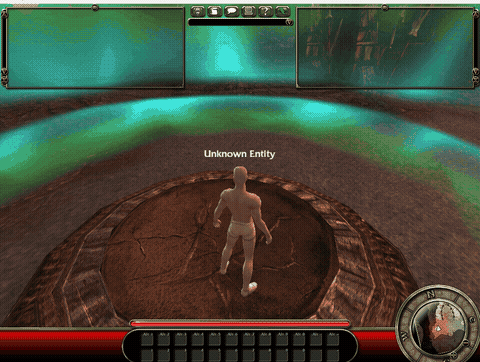
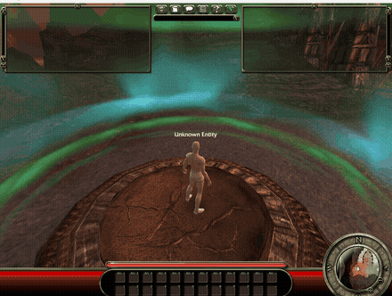

It worked.

The unmodified Fury client connected to my server, loaded Mortem, created a
character and let me walk around with WASD. Not a camera pretending to be a
character. Not a shadow belonging to nobody. A visible, animated person.

That sentence took a frankly unreasonable amount of work.

## Twelve bits in the wrong place

The last post ended with the arena loading and my controls doing something
roughly movement shaped. The camera floated around like it had been fired from
a trebuchet, and there was no body attached to it.

The server was sending the player and controller a starting rotation, meaning
the direction they should face. That seemed harmless. It was twelve bits, and
people generally need to face somewhere.

Fury disagreed.

Whether those twelve bits exist is decided by a flag baked into each kind of
game object. There is no note in the network message saying they are present.
Both ends are simply expected to know. My server had guessed that anything
spatial wanted a rotation. The original player and controller definitions both
said they did not.

So the client left those twelve bits unread, then treated them as the start of
the next property. Physics, ownership and everything after them turned into
nonsense. The message was fine until one unwanted fact shifted the rest of it
sideways.

I removed the guess and watched the client apply the real values directly in
memory:

```text
GOCombatAvatar  property=Physics  target=Actor+0x54
bytes-before=00  bytes-after=01  value=PHYS_Walking
```

For the first time, the client genuinely knew that my character was walking.
The movement stopped feeling like physics homework and the full combat HUD came
up around an actual position in the arena.


There was just one small problem. I still couldn't see the character.

## Building an invisible person

At first I thought the camera was the whole problem. Fury starts zoomed all the
way in, which switches to first person and hides your own body. Pulling the
camera back changed the right visibility flag, but the platform remained empty.
The shadow stayed, which felt a little smug.


The player did have a mesh component, but that turned out not to mean it had a
body. Fury doesn't load one finished character model. It takes a face, hair,
shirt, arms, hands, legs and feet, then stitches them together while the game is
running. My server had announced that loading was complete without supplying
any of those parts.

I gave it a plain test outfit using assets already shipped with the client. Then
I followed the entire body factory inside the running game. All seven parts
loaded. Four levels of detail were built. The result had 56 bones and thousands
of perfectly sensible vertices. Its materials and textures made it to the
graphics card.

Still invisible.

At least this was now a very well constructed invisible person.

## The renderer's objection

Eventually I found the exact decision the renderer makes for this particular
body. First it checks whether the camera is allowed to see it. With the camera
pulled back, yes. Then it checks whether the player is still in its reference
pose, the raw arms out pose used before animation takes over.

If it is, Fury refuses to draw it.

```c
if (!editorMode && avatar->bIsInRefPose) {
    avatar->RefPoseDrawCounter++;
    return 0;
}
```

That explained the excellent shadow. The body existed, but the game had decided
it wasn't fit to be seen in public.

I cleared the flag once with a diagnostic hook and the renderer immediately
entered its real skeletal drawing path. Useful proof, but changing the client's
memory isn't a server fix. I needed to know why animation had never taken over.

The answer was hiding in my pretend loadout. A new character begins with its
weapon type set to `UNSET`. Fury uses that choice to select the animation sets
and animation tree which move the body. For `UNSET`, the original code does
nothing. I had supplied the face, hair, clothes and skin colour, but not the
choice that tells this finished person how to stop standing like an unfinished
one.

I changed the loadout to Fury's `UAR` animation family. It has a weaponless
socket setup, so it suited the plain test character without adding a mystery
sword. Fresh run, no memory tricks: reference pose off, camera visibility on,
skeletal drawing active.

Then I looked at the screen.

## Somebody's home

The client connected and sailed through the loading screen. I pulled the camera
back from first person.



There they were.

A person standing in an arena, inside a game whose servers disappeared in 2008,
connected to a replacement built from its old client and a lot of stubbornness.
The name tag says "Unknown Entity", which seems fair. The server doesn't have a
database yet. It barely knows who it is either.

Standing still was enough to meet most of the milestone, but I pressed W anyway.



Actual walking. The character animates, turns and moves under keyboard input.
The client sends the same real movement messages it sent to Fury's original
servers. My tiny server currently throws them away, because simulation and
correction are problems for another day, but they are there.

This is the first proper proof that the whole idea works. An untouched copy of
Fury can join a match hosted by a server written from scratch, create the right
player, build and animate its body, and move it around a real arena.

Eighteen years after somebody switched the servers off, somebody's home.
