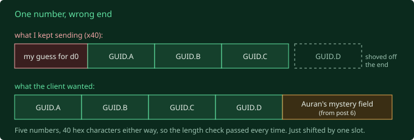
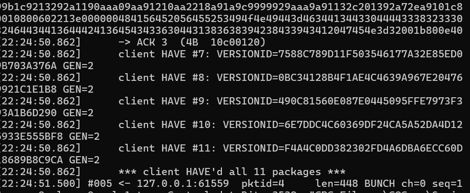

## Where I left off

The client loads the arena map, says `JOIN`, and then sits on the loading screen
forever waiting for the server to hand it a character. Handing it a character is
milestone 4. Last post was me opening the client's machine code in a
disassembler to work out the exact shape of those "here is a character" messages.

So I built the first piece of it: teach the server to open a channel and send one
game object down it. I pointed the real client at it and watched.

The client acked the packets at the network layer, the "yep, bytes arrived" level,
and then did absolutely nothing with them. No character. No leaving the loading
screen. No complaint.

This post is about the two days I did not expect to spend finding out why. It
ends well. It takes a while to get there.

## The client's shopping list

Here is the thing I was missing.

Fury is split across eleven **packages**. A package is just a big file full of
game content: code, models, tables, the lot. `Core`, `Engine`, `GOGame`, nine
others. The client has all eleven on disc. When it connects to a server, the two
sides are supposed to agree on exactly which eleven files they're both working
from, down to the version, before anything else happens. If the server's `GOGame`
is even slightly different from the client's, better to find out now than halfway
through a match.

That agreement is a back-and-forth. The server sends a line per package that says,
roughly, "I'm using `Core`, and here's its fingerprint." The client looks up its
own copy of `Core`, checks the fingerprint, and if it matches, replies "yep, I
`HAVE` that one." Eleven lines out, eleven `HAVE`s back, done.

My server wasn't sending any of them. And it turns out that when the client
hasn't done this handshake, its internal list of packages is **empty**, and every
reference in every "here is a character" message points into that empty list and
resolves to nothing. That was the whole "acks the packets, does nothing" mystery.
The character messages were arriving fine. The client just had no idea what any
of the things in them were.

So: build the package handshake. Can't be hard. It's four fields on a line.

## The client rejects the line. Every time.

I sent the eleven lines. The client took the first one, `Core`, and immediately
handed it back to me verbatim as an **error**, printed it to its launcher log as
`error USES <the whole line>`, closed the connection, and exited. Clean exit. No
crash. No log line saying what was wrong with it. Just: no.

The field it was choking on is the fingerprint, which the protocol calls
`VERSIONID`. I was sending the package's **GUID**: a 16-byte globally unique ID,
the kind of random-looking string you've seen in config files, written out as 32
hex characters. Every package has one stamped in its header. It's the obvious
thing to fingerprint a file with.

The client wanted something else. It would not tell me what.

## Into the disassembler. Repeatedly.

There was no watching-the-client way forward here. The client's answer was a
single bit, yes or no, and it was always no. So back into Ghidra, the tool from
last post that turns machine code into something almost readable, to find the exact
code that reads my `VERSIONID` and decides to reject it.

I want to be honest about how this went, because the clean version is a lie. I
opened that binary and traced this one field **six separate times** over two days.
Each read got me a more precise wrong answer.

**Read one.** The `VERSIONID` isn't 4 numbers, it's 5: some mystery leading number
the code calls `d0`, then the 4 numbers that make up the GUID. And the text has to
be **exactly 40 hex characters** or a length check trips and the parser silently
zeroes the whole thing. I'd been sending 32. So I prepended a guess for `d0`, got
to 40 characters, sent it. Rejected. Identically.

**Read two.** Found where `d0` lives in memory: it's the number sitting right
before the GUID in the client's loaded copy of the package. Also found that a
different field I'd been worrying about, `GEN`, isn't actually compared against
anything, so I could stop thinking about it. Good, but I still didn't know `d0`'s
value.

**Read three.** Narrowed `d0` to four candidate values, all version numbers of one
kind or another. Tried all four live. All four rejected. Identically.

**Read four.** Followed the code that fills in `d0` when the package loads.
It reads the 4 GUID numbers and then computes `d0` by **XORing them together**.
So `d0` is a checksum of the GUID. Not a version at all, the earlier read had
misled me with a bad label. I computed the XOR, sent it. Rejected. Identically.

At this point I have sent this client something like forty `USES` lines across
every shape I could think of, and it has said no to every single one in exactly
the same way, and I am starting to take it personally.

## The read that actually worked

**Read six.** I stopped trying to understand the function and just walked it one
CPU instruction at a time, which is slow and miserable and the thing I'd been
avoiding.

The XOR checksum from read four? Real, but it's on a branch the code only takes
for **old** packages, a legacy format from years before Fury shipped. Fury's
packages are new enough to take the other branch. And the other branch does
something much dumber and much more annoying: it reads **five raw numbers straight
off the file**, no maths. The 4 GUID numbers, and then whatever number happens to
sit immediately after the GUID in the package file.

I know that number. It's the one from post 6, the first thing that ever crashed my
decompiler: Auran wedged a mystery 4 bytes into every package header, right after
the standard GUID. In post 9 I tried every checksum recipe I knew on it, got
nothing, and wrote "no idea what this is for" in my notes.

This is what it's for. The very first number that broke my tools, two phases ago,
was the answer the whole time.

So the fingerprint the client wants is: the 32-hex GUID string, with that one
extra number stuck **on the end**. 40 characters. And every single guess I'd made
for the last five rounds had been sticking a number on the **front** and dropping
the trailer, which shoved the real first GUID number out of its slot, which is why
they all failed the same way no matter what value I used. The length check from
read one was right. The XOR from read four was real. Neither was on the code path
my packages actually hit.



One number, wrong end.

## It said yes

I changed the one line, rebuilt, sent the command to run against the real
client.

```
-> USES VERSIONID=32258DECFC2BE51049986F517664299979BE8EC9 PKG=Core ...
<- HAVE VERSIONID=32258DECFC2BE51049986F517664299979BE8EC9 GEN=2
...
*** client HAVE'd all 11 packages ***
```



First time in the entire chase the client has replied to a `USES` line with
anything other than a hang-up. All eleven. Then it ran through its checksum list,
said `JOIN`, and travelled into the arena map, same as it does when the handshake
isn't there at all, except now its package list is actually full.

## Where this leaves me

Honest ending, because the arc isn't tidy: the client is still on the loading
screen.

The package handshake was a wall, and it's down. But it was in front of a second
wall I already knew about. The server now opens a channel and sends the match's
top-level info object down it, the client acks it, the package list is seeded so
the references in it should resolve, and still nothing spawns and the loading
screen doesn't lift. Either one object isn't enough to satisfy the client and I
need to send the player-info and the controller and the character body too, or
there's a bug in how I'm encoding that first object that the client is too polite
to mention.

Same client, same silent single-bit answers, probably another few trips through
the disassembler. But the handshake works now, and it didn't this morning. I'll
take it.

## Next up

Send more of the object chain, in the order last post worked out: match info, then
player info, then controller, then the character body, each one fully open before
the next can point at it. Watch for the loading screen to lift.

