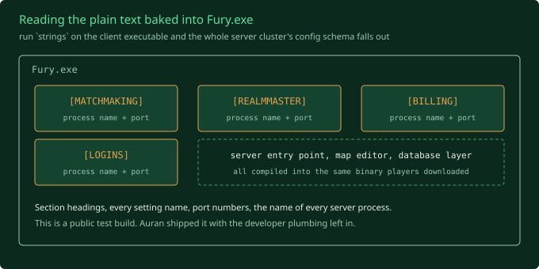
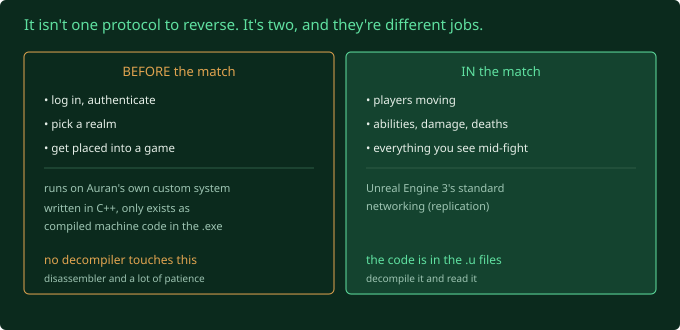

## Where I left off

Last post I introduced the project: revive *Fury*, Auran's 2007 PvP MMO, from a
single client install with no server and no source code. This post is the setup
work. 

## What I tried

First I went through the whole install and wrote down what's actually there, in
proper docs. An inventory, a target architecture, a roadmap, a glossary, a
decisions log. Boring, but it's the stuff that stops a long project turning into
a pile of half-remembered guesses.

The shape of the install:

- **`GOGame/ScriptFinalRelease/*.u`** is the compiled game code. UnrealScript
  compiles to bytecode rather than machine code, so a decompiler can turn it
  back into readable source. `GOGame.u` on its own is 9.5 MB and holds nearly
  50,000 exported symbols. This is the good stuff.
- **`GOGame/Content/`** is 6.4 GB of packages, 38 maps, and 197 little `.bin`
  files I'd written off as "some binary format, figure out later".
- **`Binaries/`** has the client executables, a launcher, and a patcher.

Then I had Claude do a second pass over the whole thing with one instruction:
assume I've missed something, and go looking in the parts I skipped. Mainly the
raw executables.

## What broke (or what I didn't expect)

Two things, and they're connected.

**One: I was aiming at the wrong unknown.** My plan treated "can Unreal Engine 3
even run a dedicated server from this old shipped code?" as the scary question.
The audit went digging in `Fury.exe` itself, just reading the text strings baked
into the binary, and the answer is basically yes. The server entry point is
compiled right into the client executable, next to the map editor, a database
layer, and the thing that stopped me: the entire configuration schema for
Auran's server cluster. Section headings, setting names, port numbers, all of
it. `[MATCHMAKING]`, `[REALMMASTER]`, `[BILLING]`, `[LOGINS]`. The name of every
server process and which port each one listened on.

I thought I had a client. What I actually have is a client built from the same
codebase as the servers, with most of the server-side scaffolding left in. That
isn't normal for a game you download. Usually that stuff gets stripped. This
looks like a public test build, and Auran left the developer plumbing in. Hoorah! Right? (Spoiler for the next post: not quite.)

**Two: there isn't one protocol to reverse, there are two, and they're very
different jobs.** The in-match networking, players moving and fighting, uses
Unreal Engine 3's standard system, and the code for it is in those `.u` files I
can decompile. That part is doable. But everything before the match, logging in,
picking a realm, getting placed into a game, runs on Auran's own custom system.
It's written in C++ and it only exists as compiled machine code inside the
executable. No decompiler touches that. Reversing it means a disassembler and a
lot of patience.

The saving grace: the launcher builds a plain text command line to start the
game, and it's readable. It looks like a URL with options bolted on
(`?login=...?realmurl=...`). If I can write that line by hand and point the
`realmurl` part at a stub server of my own, I might get into a match without
touching the custom C++ layer at all. That one experiment is now the most
important thing in the project. If it works, the hard part becomes optional.

Oh, and those 197 `.bin` files I ignored? They're the game's entire data set.
Every ability, every piece of gear, every vendor, the admin command list, the
tutorial steps. In a typed table format that converts to plain text. I'd been
about to leave the whole game design on the floor.

## What I learned

- **Read the binary, not just the "readable" parts.** I went straight for the
  decompilable code and nearly missed that the executable itself is full of
  plain-text evidence. Config keys, error messages, file paths, server names.
  Running `strings` on an .exe is a real research tool.
- **UE3 games run client and server from one codebase.** Whether you're playing
  or hosting is a launch option, not a different program. That's why the server
  bits are sitting in my client.

## Next up

Half a day of triage, all of it just running the shipped executables on a copy
of the install and reading the logs:

- does the 2007 client even start on Windows 11
- does the dedicated-server mode start
- does the map editor open (this decides how far the "new content" dream can go)
- point the login at a socket I control and see the first bytes it sends
- and the big one: hand-build that launch URL and try to reach a match with the
  custom login layer bypassed

Whatever happens, that's the next post.
