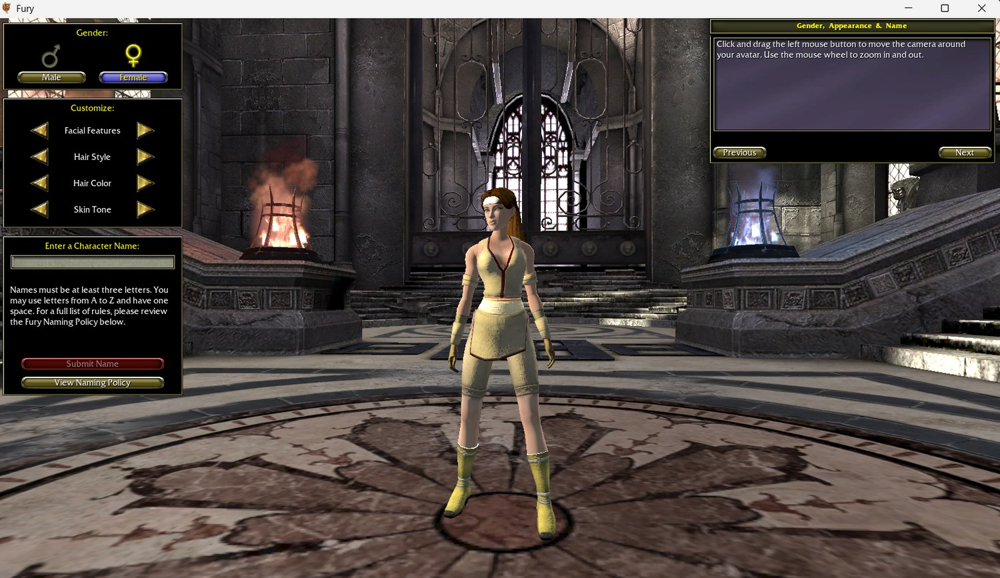
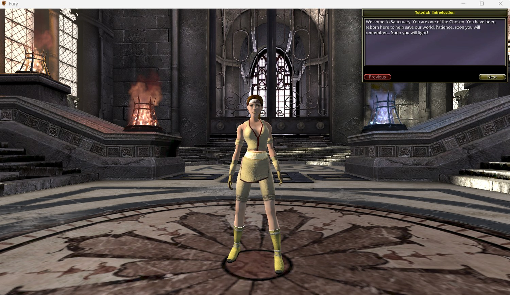
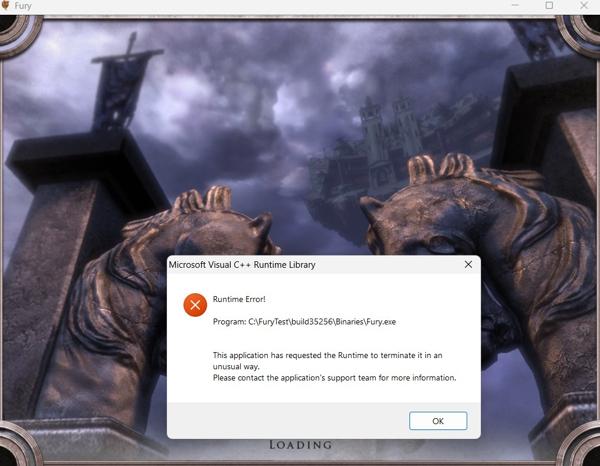
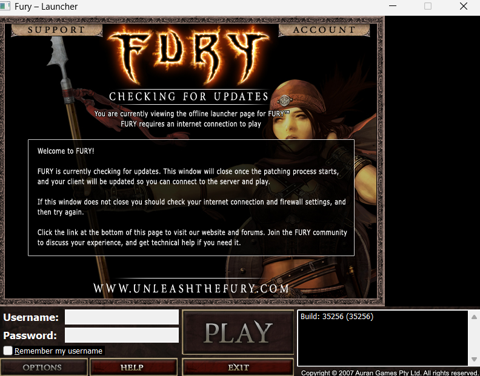
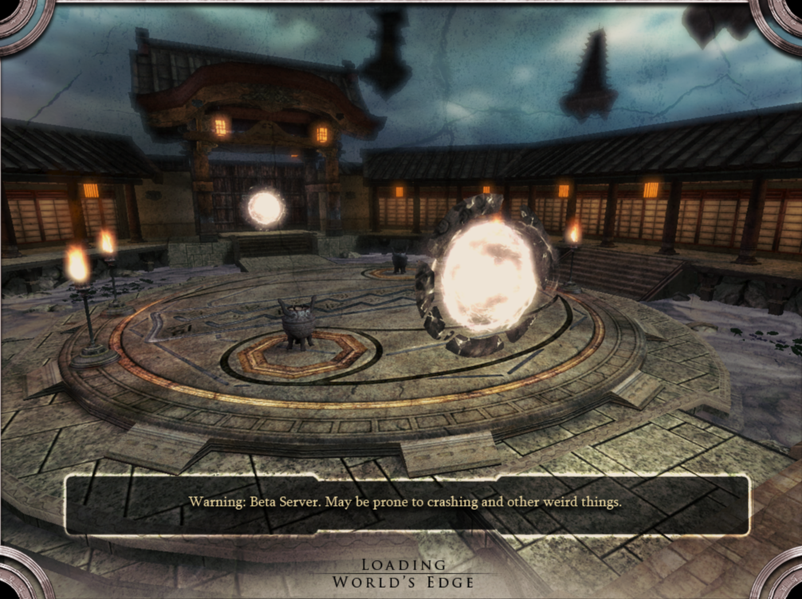

Last post a code audit ripped up my plan and handed me a list of little
experiments to run first. This is me running them. It went two very different
directions.

## Setting up without wrecking anything

I copied the entire game (about 6.5 GB) off to a scratch folder so there was no
way to accidentally wreck the original. Everything from here runs out of that
copy.

Then the log fought me. When the game runs it keeps a "log", a running text diary
of what it's doing, which is the main way you see inside a program that has no
other way of talking to you. Problem: *Fury* keeps that diary in memory and only
writes it to a file when it shuts down nicely. Kill the game and you get an empty
file and learn nothing. So I wrote a little script that starts the game, waits,
then politely asks it to close and gives it time to finish writing.

[SIDE NOTE] there's an option called `-log` that opens a live diary window while
the game runs. Do not use it. If that window ever goes into "select text" mode,
which is one stray click, Windows freezes the whole game the next time it tries
to write a line. I lost a while to that one.

## Does a game from 2008 even run on Windows 11?

Yep. First try, let's go!

I genuinely didn't expect that. This thing was built in April 2008, for Windows
XP. That's three Windows ago. No compatibility mode, no tricks. It opened, wrote
its version number to the log (build 35256), sat there running happily for a
minute, and closed clean. Didn't create a single file outside its own log
folder.

With no instructions it just shows a black window, because it goes looking for a
starting area that isn't in this copy. Normally the launcher tells it where to
go, so I did that part by hand instead: load `AVA_Creation`, the make your
character screen, with the same startup settings the real launcher uses.

That's the whole *Fury* character creator. Sliders for face and hair, the name
box with its naming rules, and a little scripted intro that plays first:

Okay then.... LET ME IN! I want to fight. Don't make me recreate the entire
server from scratch haha...

I wonder how long it's been since anyone had this up on their PC. Far out. I
could feel the cobwebs clearing, and got my first proper bit of pride out of the
project.

The log lines up with the picture too. The game started its own login sequence,
checked the command line for a username and password (both blank, it shrugged
and carried on), ran the whole "log this player in" routine with nobody on the
other end, and dropped me into the character screen. "The login stuff is all down
in the C++ where I can't see it" was one of my big fears going in, and here's a
decent slice of it running fine up in the readable layer.

[SIDE NOTE] "Why not just crack open `Fury.exe` itself and read that?" Fair
question. Tools like Ghidra (free) and IDA Pro (pricey) turn raw machine code back
into something vaguely C shaped. The problem is "vaguely". Compiling throws away
the names, the comments, the structure, and you get back thousands of functions
called `sub_1400A3F20` full of `*(a1 + 0x88)`. The game's *script* is a different
animal: it compiles to bytecode that keeps the class names and function
boundaries, so decompiling it gets you maybe 90% of the way back to what the
developer typed. Rule for this project: anything Auran wrote in script, I can
basically read. Anything down in Epic's C++ engine, I only go in there as a last
resort. (Foreshadowing. I end up in there a lot.)

## The side doors

Here's the bit of background you need. The game is one program that runs in
different modes depending on the first word after its name. `Fury.exe server`
boots it as a server. `Fury.exe editor` opens the level editor, the tool the devs
built the maps in. `Fury.exe make` rebuilds the game's script. These modes are
called commandlets, and on a normal Unreal Engine 3 game they just work.

On this copy, every one of those words gets treated as the name of a map.

`Fury.exe server` goes hunting for a level called "server", can't find it, writes
a crash report and relaunches the updater. `Fury.exe editor` looks for a level
called "editor" and throws this:

Same deal for the "check my game files aren't corrupt" mode. It looks for a level
called "check". Crash.

The help text for all of those modes is still sitting in the game's text files,
because that comes free with the engine. The machinery behind them has been
pulled out. Which, tbh, makes sense. This is the copy they shipped to players,
and the studio did not want players opening the level editor or running their own
servers.

## The last door: can it host its own game?

One more shortcut worth a proper go. Games on this engine can run as a **listen
server**: one copy of the game being client and server at once. You play on it,
and your mates connect straight to your copy. If *Fury* can do that, I don't have
to rebuild the match server at all.

Turning it on is one extra word on the startup line: `listen`. So I took the
**exact startup line that works**, the character screen one, and added that word.
Nothing else changed.

The game died in about half a second. No window, no error. It wrote a crash file
and relaunched its updater:

I ran it four ways to be sure it was really the `listen` word: working area with
it, hub area with it, hub area without. Every run with `listen` died the same way
in half a second. Every run without it got further.

The run without it, pointed at a real hub map instead of character creation, was
interesting in its own sad way. The game started up the hub's rules fine, then sat
on the loading screen for twenty nine seconds and crashed.

Character creation works offline because it has a special fallback: a canned
"blank slate" character it loads from disk. A real map doesn't have that. It
expects the character storage service and the realm service to be alive and
feeding it who you are. They're not, so it hangs, then dies.

## Four for four

Editor, dedicated server, file check, listen server. Every developer entrance in
this build is sealed, and sealed the same way. The game never says "that's
disabled". It pretends its own files are broken and sends you to the repair tool,
which then tries to fix them by phoning a server that shut down in 2008. It's the
software version of a shop with a "back in 5 minutes" sign that's been on the
door since the Global Financial Crisis.

Honestly? Consistent, at least.

So the server has the code inside it (last post), but I can't get to it by typing
a magic word. If *Fury*'s server ever runs again, it's going to be one I rebuild
from the readable script. I just got married last week. Who knows how many
anniversaries will pass before I've got this game up and running. Weird metric,
but yeah.

One useful side effect of doing the boring triage first: my plan literally said
"get one match running on a local server using `Fury.exe server`". That command
does not exist. Better to find that out in an afternoon than a month in.

Small consolation from all the crashing: I now know exactly what *Fury* does when
it panics. It writes `fury-v35256.dmp` and relaunches its updater with an `error
corrupt-files` flag. So if that updater ever pops up and I didn't ask for it,
that's what happened. Not a real alarm, just the game giving up and passing me to
the repair tool.

Next: one more experiment before I pick up the long road. Point the game's login
at a program I control and listen to what it says.
