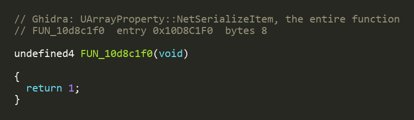
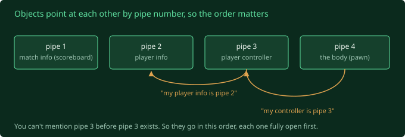

The client loads the arena map, says `JOIN`, and sits on the loading screen
waiting to be handed a character. Handing it one is the next job. Two questions
stand in the way: what did the real server actually *do* to put a player in a
match, and what exactly do those "here is a character" messages look like on the
wire?

## How a real server did it: the hotel

The first one I could answer by reading. Fury's script has a function called
`GOPostLogin`, which runs once the server has accepted a player. I expected it to
create your character. In a stock Unreal game it would.

It doesn't. It talks to your character as if it's **already there**:

```
if (NewPlayer.Pawn != none)   // "if this player already has a body..."
    NewPlayer.Pawn.ClientSetRotation(...)
```

("Pawn" is Unreal's word for your physical body in the world. The "controller"
is the invisible brain driving it, a human's connection or an AI.)

So I followed the calls backwards, and the answer surprised me. In a Fury arena
match, your body is spawned **before your client ever sends a packet.**


It's a **hotel**. The reservation comes in ahead of you, the room gets made up,
your bags are already in it. When you finally reach the front desk, checking in
isn't "build me a room", it's "swap housekeeping's key for mine". That swap is one
Unreal call, `Possess`. Humans and bots come in through the exact same door, which
is tidy.

While tracing it I hit something that looked like a bug. The check in code finds
your room by your character ID, and if it can't find a match it does this:

```
LogInternal("... unknown avatarID ...");
Controller.Destroy();
```

On the shipped client's code path, nothing ever gives your controller a character
ID. The two functions that would are both switched off (post 7). So the shipped
code, turned into a server as is, would look up character `0`, find nothing, and
delete every single player who connected. Every time. Not a bug, it turns out.
Evidence: one of those build time switches *has* to be the other way round in a
real server build, or nobody gets in.

## The client goes quiet

The second question, the byte format, lives in the engine's compiled C++, not the
script. Up to now my trick has been: send a guess, watch what the client does. So
I went to switch on the engine's network logging, which can narrate every message
and every field.

I deleted the two config lines that silence it. Ran it. Same tiny fifteen line
log, with a note in it that literally says `[1 lines suppressed]`.

When a studio ships the final version of a game, they build it in a mode that
strips almost all the logging out of the program for speed. I was editing
instructions for a diary that isn't in the `.exe` anymore. The config even names
a debug build with all the logging left in, `DEBUG-GOGame.exe`. It's not on the
disc. Of course it isn't.

So the client still answers my guesses, but only in grunts now. Leaves the
loading screen or doesn't. Crashes or doesn't. Not enough.

## Opening the patient up

Which leaves the option I'd been saving for "much later": read the engine's actual
machine code, the raw numbers the processor runs, with every helpful name thrown
away.

The tool is a **disassembler**. The good free one is Ghidra, built by the NSA and
then open sourced, which is a sentence I never expected to type on a game blog.
You feed it the `.exe` and it untangles the numbers into something that reads
*almost* like C: ugly, variable names like `param_3`, but followable if you're
patient.

Even a stripped `.exe` keeps its error messages, things like `bunch header
overflowed`, because they have to be printable if something goes wrong. And the
code that prints them sits right next to the code I care about. So: pull every
networking string, find the code that uses each one, and 15 MB of machine code
becomes about fifteen addresses worth looking at.

Ghidra chewed on the binary for thirty five minutes and handed back the eleven
functions that matter, plus their helpers. About 300 KB of almost C. I didn't
read all of it line by line myself. I had Claude do the first pass through the
dump with the specific questions I needed answered, then went through its
findings against the raw code and my captures.

## What was in there

**I'd been lucky.** Back when I decoded the message header by hand, I labelled
three bits as "a flag, then two spare bits". Wrong. Those three bits are a number
that says **what kind of channel this is**: control, actor, file, voice. My server
had been sending "control channel" for everything, which happened to be right for
the handshake. It would have been silently wrong for every single character
message. Found it before it cost me a week. Yozza.

**A whole job that doesn't exist.** I'd budgeted time to work out how the client
reports which messages it received (the "ack history", real fiddly in later
versions of the engine). This build doesn't have one. It just says "got 340" and
the server works out 338 and 339 went missing from the gap. One fewer thing to
build.

**The one that made me laugh.** The engine has a function for sending a growable
list (an "array") across the network. I went to read how it encodes the length and
the elements. Here it is. All of it:



That's the entire function. It does nothing and says "done!". In this build, a
growable list in networked game data just never syncs, and nothing warns you. The
most honest thing about it is that it's only eight bytes long. Everything I need
uses fixed size lists, so it doesn't bite me. But what a thing to find.

**Objects point at each other by pipe number.** When the game needs to say "this
player's controller is that object over there", I expected an ID. It isn't. It's
the **channel number**: "that object is the thing coming down pipe 4". So an
object needs its own pipe open before anything is allowed to mention it, and
everything has to go in order.



## Two doors into the arena

With the format written down, one decision left. **Door one** is the hotel:
fake the matchmaker's dossier, fake the database, dig spawn points out of the map
file. Faithful. **Door two** is a side path in the code: if the server tells the
client this is a *simpler* kind of Fury game, not a combat arena, the character
gets spawned the plain stock way when the client connects. No dossier, no
database.

The engine dig settled it. The genuinely hard part, getting every byte of those
character messages right, is identical through either door. The faithful route
just adds four fakes and a file parser on top. And where you spawn is just three
numbers in the message, so I can put the character anywhere. Door two, with door
one in my back pocket.

(Epilogue from the future: I never actually ran door two's thirty second test.
The server kept announcing the full combat game the whole time, and the real
character classes ended up coming straight from the combat game anyway. The plan
said one thing and the code quietly did another, which will become a theme.)

For the first time since this phase started, the character messages aren't a wall
of unknowns. It's a spec. Now I just have to type it out.
