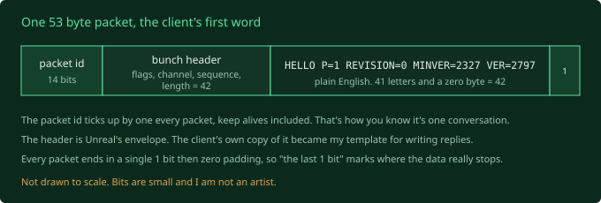
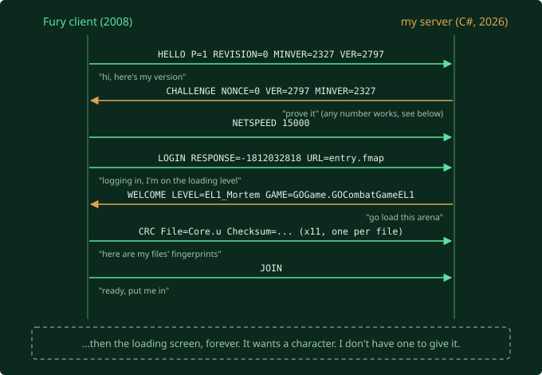

Last post ended with a to do: point an unmodified Fury client at a network port
with nothing on it, and listen to what it says when it tries to join a match.
Whatever comes out first is the opening line my server has to learn to answer.

This post goes from that first word to the client packing its bags for the arena.
It's the most fun I've had on the project so far.

## A brick wall with a notepad

**The fake ear:** forty lines of Python that grabs a port on my machine, writes
down every byte anything sends it, and never replies.

One thing I didn't want to guess: *which kind* of port. Network traffic comes in
two flavours. TCP is a phone call: connect, talk, hang up, nothing gets lost. UDP
is postcards: fire and forget. Unreal's networking has a class literally named
`TcpNetDriver`, which sounds like it settles it. It does not. Despite the name,
Unreal games have always run gameplay over UDP. Naming things is hard, and somewhere
along the way somebody at Epic lost that fight. So I listened on both.

**The client, aimed at nothing:**

```
Fury.exe 127.0.0.1:7777
```

`127.0.0.1` is "this same machine", `7777` is Unreal's traditional game port. In
post 4, every attempt to make the client *host* a game detonated instantly. I
half expected the same. Instead the log said `Server Address: 127.0.0.1`, loaded a
blank placeholder level, and started dialling. The join door is wide open. Only
the host door is nailed shut.

## Its first word

UDP lit up. TCP stayed dark. Then the content. I was braced for binary gibberish,
because Unreal's game traffic is normally bit packed and unreadable. The first
packet was 53 bytes, and after an 11 byte wrapper, the rest was plain English:

```
HELLO P=1 REVISION=0 MINVER=2327 VER=2797
```

That's it. The client's first word, after eighteen years. A greeting, a platform
number (`P=1` is Windows), and version numbers so both sides can check they're
compatible. It's basically a chat protocol. The original Unreal games around 2000
ran their whole join like this, and Fury in 2008 still does, at least for the
opening. Pure upside for me: I can read the negotiation with my eyes.



It didn't say it once, either. `HELLO`, wait a second, `HELLO` again, with a tiny
two byte "still here" blip every fifth of a second in between. After ten seconds
of silence it gave up, and gave up *politely*:

```
FAILURE Connection timed out, no connection to server
```

No crash dump. First time I've watched this client fail at something and just
shrug and exit, instead of pretending its files are corrupt. I ran it twice and
the two recordings are byte for byte identical apart from the counter. No
timestamp, no random number, no secret token. The opening is fixed. I can
hard code it.

## My server hears it

Then I started typing the actual server. C#, two small projects, open port 7777,
loop forever, try to make sense of anything that arrives. About a hundred lines,
and all it does is catch the `HELLO`, pull out the packet number, check the
version numbers, and print "yep, heard that". It's a very elaborate way to say
"mm hmm". But it's the first code I've written that sits in the dead server's
chair.

I tested it two ways: against the 104 packets I'd saved from the sink run (it
decoded every one exactly like the known good Python did), and live, against the
real client. Both clean. Getting there took two goes, because my first version
turned bytes into text *before* hunting for the text, and any byte that isn't a
valid letter quietly becomes a `?`. Which is a printable character. So my scanner
would find a lovely long run of question marks and lock onto garbage. Lesson I've
re learned maybe five times in my life: "just turn it into a string" is where the
information leaks out.

I also picked the arena: **`EL1_Mortem`**. One versus one elimination, the
smallest game mode, the smallest of the four 1v1 maps on disk, and a game class
that's 54 lines long. When you're trying to get *anything* working, start in the
smallest corner.

## Saying something back

To reply, I have to wrap my text in Unreal's envelope (that "bunch header" in the
diagram) bit for bit, exactly how this 2008 build expects. One bit in the wrong
place and the client bins the packet without a word. And the format drifted over
the engine's life, so write ups online mostly describe the wrong version.

So I didn't look it up. I already had a perfect example: the client's own `HELLO`.
I bit decoded it by hand, one field at a time, wrote an *encoder*, and pointed it
at the client's own values. If I understood the layout, it would spit out the
exact 53 bytes the client sent.

```
want (53B): 0080052080c0850a000000521113d313085...dce0d40
got  (53B): 0080052080c0850a000000521113d313085...dce0d40
SELFTEST PASS: encoder reproduces the client's HELLO byte-for-byte.
```

Byte for byte. In the old Unreal handshake the server's answer to `HELLO` is
`CHALLENGE`, normally "here's a random number, prove you know the secret". So I
sent `CHALLENGE NONCE=0` and left the log running.

The client answered with `NETSPEED 15000` (how much bandwidth to send it) and
`LOGIN RESPONSE=-1812032818 URL=entry.fmap` ("logging in, here's my proof, I'm
sitting on the little loading level"). Then it **acknowledged my packet**, which
Unreal only does for a message it accepted as well formed.

For eighteen years this program has sent `HELLO` into nothing and timed out. Give
it one sentence back and it just... carries on.

The best bit: that challenge response is fake. I tried `NONCE=12345`. Same
response. No nonce at all. Same response, `-1812032818`, every time. It's a
security check where the answer is always the same number, no matter the
question. Like a bouncer who asks for ID and accepts a Countdown receipt. My
server doesn't have to validate anything. Saves me a whole crypto dance.

## WELCOME

After `LOGIN`, the client waits for one word: `WELCOME`, the server saying "you're
in, your match is on this level, go load it". First I had to fix my parser, which
stopped reading a packet the moment it hit an acknowledgement, and the client had
started stacking an ack in front of its `LOGIN` in the same packet. So my server
never saw the login. Classic.

Then I sent my best guess:

```
WELCOME LEVEL=EL1_Mortem GAME=GOGame.GOCombatGameEL1
```

The client's log, immediately:

```
UGOGameEngine::OnMapChangeStart> map='EL1_Mortem'
```

It believed me. It packed up and started loading the actual arena. Sweet as.

Then a burst: eleven `CRC` lines, fingerprints of each of its script files, so a
real server could go "your `GOGame.u` doesn't match mine, get lost, cheater". And
then the last message:

```
JOIN
```

"I'm ready. Put me in the match."



## Where it stops

Right there. `JOIN`, then five heartbeats a second, on the `EL1_Mortem` loading
screen, bar not moving, for as long as I let it run.

That's expected. An Unreal client doesn't leave the loading screen when the map
finishes loading. It leaves when the *server* hands it a character to control. So
that's the whole next job: spawn a character and stream its existence down the
wire.

Somewhere on the far side of that, a character stands up in Mortem. Surely that
can't take long. (Narrator: it took the rest of the blog.)
