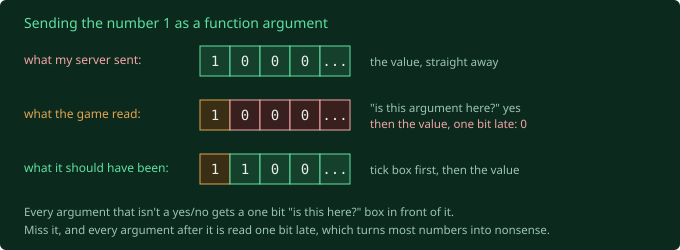

Last post ended with the game hanging up on my server at 45 seconds, every time,
because my server said its piece and then went completely silent. Fair enough,
really. I'd hang up too.

## Mm, mm, mm

The client had the answer the whole time. Every fifth of a second it sends my
server a tiny packet that says nothing. Two bytes: `E7 40`. A packet number and a
single bit that means "end of packet". It's the network version of going "mm" on
the phone so the other person knows you haven't hung up.

So my server does it too now. First run: 398 "mm"s in 90 seconds, every one
acknowledged, and nobody hung up on anybody. First time the connection has ever
outlived that timer.

Then the test rig closed the game at the end, and my *server* crashed. Windows had
bounced one of my "mm"s back with "nobody's home", and reported it as a connection
being "forcibly closed". On UDP. Which doesn't have connections. One setting to
make Windows stop being dramatic.

## Whose body is this

The game had been logging this line every single frame:

```
GOPlayerController.PlayerTick> pawn.playerInfo=None
```

Roughly: "the body I'm driving doesn't know whose it is". The body has a field
pointing at your player record (name, team, health). I'd never sent it. And it
only accepts Fury's own flavour of player record, not the stock Unreal one I'd
been using. Send the wrong type and the game quietly sets it to nothing, no error,
and I'd have lost a day. Fury's game rules name the right one, so that's what goes
now. The twelve thousand line complaint is gone.

## The loading screen has a clipboard

I was watching all this live on my own screen, and my report after the first run
was short: still on the loading screen.

So I went looking for the code that takes the loading screen down. It's
surprisingly readable. The server calls `OnSendDataToClientComplete` on your
character, and half a second later the game runs `OnLoadingCompleteCheck`. My
server had never called it, because I didn't know it existed. I sent it. The game
ran it. I watched the check run. Still on the loading screen.

The game's own log had the reason:

```
GOAvatar.OnLoadingCompleteCheck> !m_bHasPrecachedAbilities
```

Followed by "84 lines suppressed", which is that same line every half second for a
minute. Fury's combat character runs a checklist before it'll let the curtain up:

```
OnLoadingCompleteCheck, every 0.5s until it passes:
  [x] I have a player controller
  [x] I've received my body data
  [ ] I've precached my abilities      <== stuck here
  [ ] the character manager isn't busy
  then: drop the loading screen
```

A bouncer with a clipboard, and my name's only half on it.

"Precached abilities" means preloading the effects for every skill in the match,
so the first time you swing an axe it doesn't hitch while it loads the sparks. The
server is meant to send a list of what to preload. I never sent one, and there's a
line that literally says "if the list is empty, return" sitting just above the
line that ticks the box. Which is fair. You wouldn't want to walk into an arena
with nothing loaded either.

## The list starts with a zero

I didn't want to invent ability IDs. That's how you get a game that loads
something random, or falls over. So I read how the real server builds the list,
and someone at Auran made my life easy. The very first thing it does:

```
if (m_instanceCache.Length == 0)
    m_instanceCache[0] = 0;
```

Slot zero, value zero, always. The rest came out of Auran's long gone database,
but every real list ever sent started with a `0`. So I sent an honest first batch:
one entry, and it's `0`.

The game writes what it received into its log, a built in receipt:

```
ClientNotificationOfAvailableCacheEntries> 0 [0]
```

Zero entries. I said one, it heard zero.

Into the engine code that reads function arguments. Every argument, except yes/no
ones, gets a little "is this one here?" bit in front of it. Like a form where every
box has a "not applicable" tick box beside it. My server wasn't ticking the boxes.



One line. Next run: `1 [0]`. The receipt matches.

## Which means I'd been wrong for four posts

That rule applies to every function call my server has ever sent. Including
`ClientRestart`, the "this body is yours now" call I celebrated last post. It
carries a reference to your body, and the game had been reading it one bit late.
Almost certainly as "nobody". And the game had actually told me. The client went
into a state called `WaitingForPawn`, which is exactly what `ClientRestart` does
when it's handed nobody. I noticed it, wrote it down, and moved on.

"The game ran my message" and "the game understood my message" are two different
things. Apparently I have to learn this one monthly.

## One more reason

List arrived. Log still said `!m_bHasPrecachedAbilities`. So I followed the list to
where it gets used, a function that runs every frame as part of the player's
update. Near the top:

```
if (HUD == none)
    return;
```

The HUD is everything drawn over the game: health bar, ability buttons, minimap.
No HUD, and the update quits before it gets anywhere near the list. And the HUD
isn't something the game makes for itself. The server tells it: "here's your HUD
type, make one". Fury's arena names `GOCombatHUD`. My server never said it.

## It came down

Run four. The server sends four things: your body, your HUD, the preload list, and
"that's everything". The game's log:

```
ClientNotificationOfAvailableCacheEntries> 1 [0]
GOFXRepository.ReleaseCachedAbilityAssets> todo: something here
GOAvatar.OnLoadingCompleteCheck
UGOGameEngine::OnMapChangeEnd> map='EL1_Mortem'
UGOGameEngine::DisableLoadingScreen> 1
```

`DisableLoadingScreen`. First time in this entire project.

And the second line is a real Auran developer's to do note, shipped in the final
build in 2008 and printed in my log eighteen years later. Whoever you are: it's
still a to do.

Then I looked at my screen.


That's *Fury*. Actually running, in an actual arena, off a server I wrote. The
ability bar, the compass, the lava, all of it. Eighteen years after the servers
went dark.

And the very first thing the game says to me, in big blue letters, dead centre:
**Connection Interrupted.**

Honestly? After this entire blog, it's the most accurate thing anyone has said.

## Where that leaves it

The last thing the game does when the loading screen drops is tell the server
"I'm in". That message never arrives at my server. After the drop, everything it
sends me is just "got your packet, got your packet". I don't know yet why the "I'm
in" goes nowhere, or exactly what the game's looking at when it decides the
connection's interrupted, and I'm not going to guess.

There's also no character in view that I can see, and judging by the name I gave
that capture, the camera isn't anywhere near where the action would be. Body,
controls, an actual swing of an axe: all still to come.

But I've been staring at that loading screen since post 10. It's gone. I'll take
the lava.
