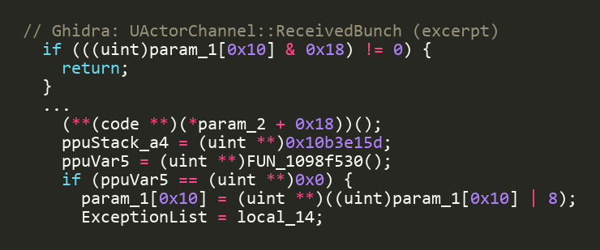

The package handshake finally works (post 13). The client's list of game files is
full for the first time. So I did the obvious thing: send the whole chain of
objects the client needs, in the order from post 11. The scoreboard (Unreal calls
it the `GameReplicationInfo`), the player info, the player controller, the body.

## The client nods and does nothing

```
*** client HAVE'd all 11 packages ***
*** client JOIN ***
   actor replication armed: ch1:GRI -> ch2:PRI -> ch3:PC -> ch4:Pawn
   [session] actor channel 1 <- GRI: 1 bunch
   [session] actor channel 2 <- PRI: 1 bunch
   [session] actor channel 3 <- PC: 1 bunch, 2 refs deferred
   [session] actor channel 4 <- Pawn: 1 bunch, 1 ref deferred
<- ACK 9,10,11,12,13,14,15,16,17,18,19,20,21,22
<- (keepalive)
<- (keepalive)
<- (keepalive)
```

That's the run. The client acks every packet, sends nothing back on any of the
four channels, never complains, never crashes. Then it just breathes: keepalive,
keepalive, keepalive, until my test window closes. It's exactly what it did weeks
ago when I sent **one** object with an **empty** file list. Four objects, full
list, careful ordering: no different. It's not waiting for more. It's binning what
I already sent.

## The function that says nothing

So back into Ghidra, on the function that receives one of these objects and turns
it into a live thing in the world. And there it was:



In English: if the object reference doesn't resolve to a real thing, set bit 8 on
the channel, which means "broken", and return. No message back. No log line.

And the top line is the kicker. Once that bit is set, every future message on the
channel hits `if (flags & 0x18) return` and gets dropped before anything looks at
it. The channel doesn't fail once. It goes deaf, for good. Meanwhile the client
keeps acking the packets, because that happens earlier, somewhere that doesn't
care what the channel does with them. It's shouting into a letterbox that's been
welded shut, and the letterbox politely signing for every delivery.

## Two ways to count the same thing

So why doesn't the reference resolve? On the wire it's just a number, an index
into the client's big combined list of game objects. My server makes the number
from a field stored on every object called `NetIndex`. The client reads it back by
counting positions in the file's table of contents. Those only agree if every
object's stored field equals its position.

I added a column to my inspection tool and printed them side by side:

```
class                            NetIndex   position
Engine.GameReplicationInfo           5326       5342
Engine.PlayerReplicationInfo         9421       9437
GOGame.GOPlayerReplicationInfo      40675      40675
GOGame.GOCombatAvatar                8376       8376
GOGame.GOPawn                        4740       4740
```

Every Fury class: identical. Both stock engine classes: off by **sixteen**.
Exactly sixteen, at position five thousand and at nine thousand. That's not noise.
Somewhere near the front of `Engine.u` sixteen entries got a slot in the table but
no stored number, and everything after them carries the gap.


And the scoreboard, the very first thing I send, the thing the loading screen is
waiting on, is a plain stock object. Straight out of `Engine.u`. The one file out
of eleven where the numbers disagree. Of course it is.

## The fix went in. It is correct. It did nothing.

Send the position instead of the stored field. One line. Self test passes. The
scoreboard's number goes from `6686` to `6702`. I diffed the raw bytes against the
old run:

```
before:  18 80 0d 20 00 ed 00 0f 0d 00 00 50 43 c4 02
after:   1c 80 0d 20 00 ed 00 17 0d 00 00 50 43 c4 02
```

Byte seven, `0f` to `17`. Moved by exactly the amount the fix adds. It is on the
wire.

And the client does nothing. Byte for byte, the same dead end.

## A gate that wasn't on the path

While reading that function I'd noticed a second check, and flagged it as "trap
number one, for later". After resolving the object, the client walks it up to the
file it lives in and requires that file to be on a list the map carries. The
scoreboard's file is `Engine.u`. I'd assumed it's always loaded, so of course it's
on the list. But "loaded" and "on the list" are different questions. Trap one,
right on schedule!

I went and traced everything that fills that list. It's the map's streaming
chunks: pieces of level geometry that load as you walk around. Script files never
go on it. Bad news?

Except the check never runs. Before it gets there, the function walks the object
up its chain of owners looking for a level. The scoreboard is owned by `Engine.u`,
which is owned by nothing. No level found, so "is its file on the map's list"
doesn't apply, and it jumps straight to the success path. The wall I spent a
session tracing isn't blocking the path. It isn't *on* the path.

## Checking my own homework

One loose end left that didn't need a running client: is the sixteen real, or a
bug in how *my* tool reads the file? If it's an artifact, both numbers I've sent
are wrong and there's a third one I haven't tried.

So I wrote a second reader from scratch. 150 lines of Python, sharing no code with
the first, reading the file straight off the disk. It agrees on every number. The
sixteen is real, sitting in `Engine.u` on disk. The file list is built right. And
going back through an old capture, the client answers my eleven files in exactly
the order I sent them, so our lists are in the same order too.

Everything I can check from out here, I've now checked.

## The pattern

Twice in one stretch I read a check that *could* reject my data, wrote it up as
the problem, then found the code never reaches it the way I assumed. Static
reading is great at narrowing a problem and terrible at the last inch. The last
inch needs the thing actually running.

Which means a debugger on the live client. And a debugger, it turns out, needs a
person at the keyboard. That person is me.
