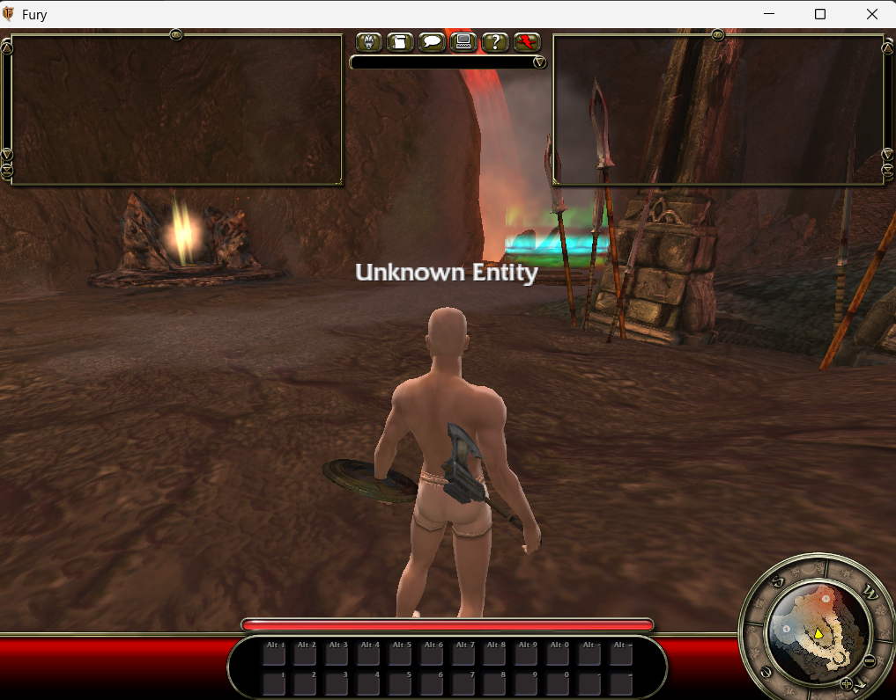
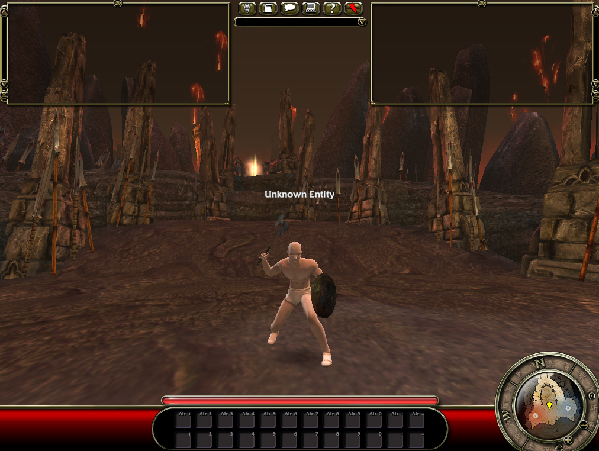

The character could walk, but the network traffic looked like someone leaning
on a doorbell.

Fury was sending roughly two movement updates in nearly every message. That
wasn't a special movement mode. It was a backlog. My server received each move,
printed it, and then sat there in complete silence, so the client bundled the
old move with the new one and tried again.

There are actually two different ways the server has to say "got it". One
confirms that the network packet arrived. The other calls a function inside the
client named `ClientAckGoodMove`, handing back the timestamp of the newest move
the server accepted.

```text
client:  ServerMove(t=1.24) + ServerMove(t=1.29)
server:  packet received
server:  ClientAckGoodMove(t=1.29)
client:  clears everything up to 1.29
```

The old capture had 2,278 `DualServerMove` calls and seven plain
`ServerMove` calls. After I added both acknowledgements, I ran the untouched
client again. It sent 1,191 plain moves and zero dual moves. Nothing malformed,
nothing piling up behind them.

The server still isn't simulating those moves itself. That is a much larger
job involving collision, physics and position corrections. For now it can read
what the real client says, prove that every parameter ended on the right bit,
and stop asking the client to repeat itself forever.

Next I need to make sure the same server process can survive a disconnect and
let the client back in. One conversation at a time.

That plan got bumped by a more important question: can I put the character in
the actual arena instead of the little holding platform where matches start?

The map has four official player starts. Every one of them is tagged
`Deathschool`, and the match start code doesn't move the player somewhere else.
It just changes the match from the warmup phase to the fighting phase. Useful,
but not much help when I'm still missing most of the objects that run a match.

I went back into the map file and used one of its navigation points instead.
Those are spots the original developers placed for characters to walk through,
so it gives me a real coordinate without making one up and hoping there's a
floor under it.

The first unattended run sat there for a full minute. The client reported the
map coordinate plus exactly 30 units for the character's collision capsule,
3,019 times in a row. No falling through the world. No network tantrum. Then I
stood at the keyboard and checked it properly. The character was in the
playable arena and could walk around freely.

The next job was putting an actual weapon in those empty hands. The client data
has an equipment row for an axe and shield, an animation style for that exact
pair, and a model row naming both meshes. I sent those values with the pawn's
appearance data and got this:



That looked like a bad attachment transform. It was actually a good attachment
in the wrong state. Fury has two complete sets of weapon attachment points. In
combat it uses bones in the hands. Outside combat it stores each weapon style
on named sockets around the body. The server shortcut had never told the pawn
that combat had started, so the client quite reasonably sheathed everything.

The transition was already in the shipped script. When the player's replicated
combat state changes to `COMBATSTATE_COMBAT`, the pawn switches animation sets,
detaches both weapon components, and reattaches them to the two hand bones. I
added that one state value and ran the untouched client again.



The character is now standing in Mortem with a real Fury weapon set in hand.
The hotbar beneath him is still empty. Filling one slot with an ability that the
client data explicitly allows for this weapon style is next.

That compatibility is not something I have to infer from an ability name. Each
ability has a row of weapon style flags in the shipped client data. I picked one
whose Axe and Shield flag is set and whose other eight style flags are all
clear. The same data includes its tier, icon and combat restrictions.

The pawn also has its own network call for receiving all 24 combat slots. Slot
one now carries that ability and the other 23 are empty. The client is meant to
construct the ability object, load its shipped icon, then rebuild both hotbars.
The packet is implemented and passes the server tests. The honest next line is
still the visual check in a fresh client, so this draft stops there for now.
