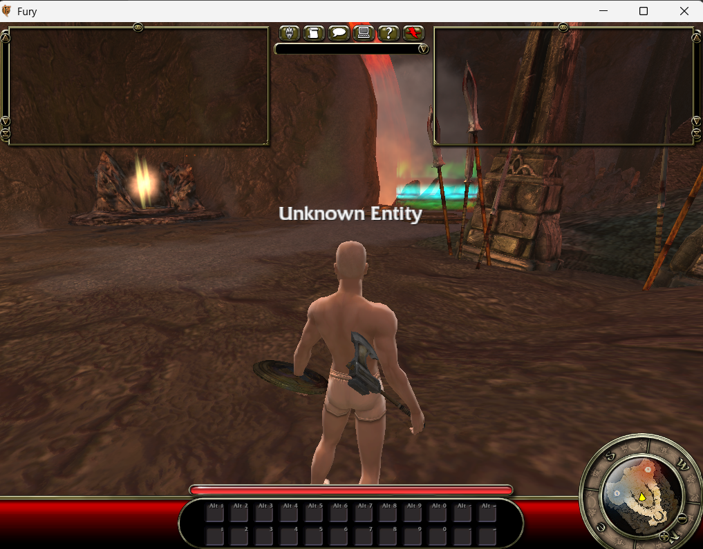
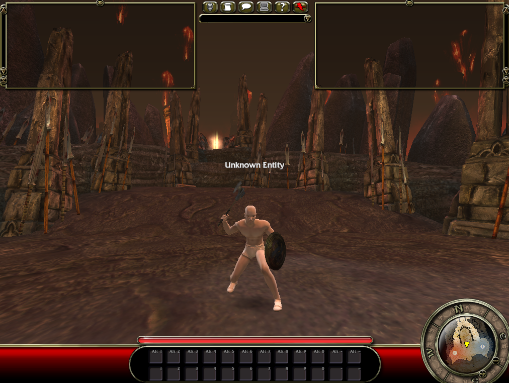

The character could walk, but the network traffic looked like someone leaning
on a doorbell.

Fury was sending roughly two movement updates in nearly every message. That
wasn't a special movement mode. It was a backlog. My server received each move,
printed it, and then sat there in complete silence, so the client bundled the
old move with the new one and tried again.

There are actually two different ways the server has to say "got it". One
confirms that the network packet arrived. The other calls a function inside the
client named `ClientAckGoodMove`, handing back the timestamp of the newest move
the server accepted.

```text
client:  ServerMove(t=1.24) + ServerMove(t=1.29)
server:  packet received
server:  ClientAckGoodMove(t=1.29)
client:  clears everything up to 1.29
```

The old capture had 2,278 `DualServerMove` calls and seven plain
`ServerMove` calls. After I added both acknowledgements, I ran the untouched
client again. It sent 1,191 plain moves and zero dual moves. Nothing malformed,
nothing piling up behind them.

The server still isn't simulating those moves itself. That is a much larger
job involving collision, physics and position corrections. For now it can read
what the real client says, prove that every parameter ended on the right bit,
and stop asking the client to repeat itself forever.

Next I need to make sure the same server process can survive a disconnect and
let the client back in. One conversation at a time.

That plan got bumped by a more important question: can I put the character in
the actual arena instead of the little holding platform where matches start?

The map has four official player starts. Every one of them is tagged
`Deathschool`, and the match start code doesn't move the player somewhere else.
It just changes the match from the warmup phase to the fighting phase. Useful,
but not much help when I'm still missing most of the objects that run a match.

I went back into the map file and used one of its navigation points instead.
Those are spots the original developers placed for characters to walk through,
so it gives me a real coordinate without making one up and hoping there's a
floor under it.

The first unattended run sat there for a full minute. The client reported the
map coordinate plus exactly 30 units for the character's collision capsule,
3,019 times in a row. No falling through the world. No network tantrum. Then I
stood at the keyboard and checked it properly. The character was in the
playable arena and could walk around freely.

The next job was putting an actual weapon in those empty hands. The client data
has an equipment row for an axe and shield, an animation style for that exact
pair, and a model row naming both meshes. I sent those values with the pawn's
appearance data and got this:



That looked like a bad attachment transform. It was actually a good attachment
in the wrong state. Fury has two complete sets of weapon attachment points. In
combat it uses bones in the hands. Outside combat it stores each weapon style
on named sockets around the body. The server shortcut had never told the pawn
that combat had started, so the client quite reasonably sheathed everything.

The transition was already in the shipped script. When the player's replicated
combat state changes to `COMBATSTATE_COMBAT`, the pawn switches animation sets,
detaches both weapon components, and reattaches them to the two hand bones. I
added that one state value and ran the untouched client again.



The character is now standing in Mortem with a real Fury weapon set in hand.
The hotbar beneath him is still empty. Filling one slot with an ability that the
client data explicitly allows for this weapon style is next.

That compatibility is not something I have to infer from an ability name. Each
ability has a row of weapon style flags in the shipped client data. I picked one
whose Axe and Shield flag is set and whose other eight style flags are all
clear. The same data includes its tier, icon and combat restrictions.

The pawn also has its own network call for receiving all 24 combat slots. Slot
one now carries that ability and the other 23 are empty. The client is meant to
construct the ability object, load its shipped icon, then rebuild both hotbars.
The icon appeared in a fresh client, which closed that part of the job. It also
started a useful sequence of failures. My first choice was grey because it
consumes four charges the shortcut character does not have. The second looked
enabled, but the weapon in the character's hands is currently appearance data,
not an inventory item. Fury's real ability check therefore still considers the
character unarmed.

I replaced it with a shipped ability that explicitly supports that unarmed
state and costs no energy or charges. Clicking it still did not send anything
to the server. Pressing the physical number key did not either. That rules out
the button itself and leaves a client-side gameplay prerequisite.

The script names two required objects. A normal server creates a combat-values
actor for the player record and a cooldown-timer actor for the pawn. The hotkey
path refuses to continue if either reference is missing. The shortcut now
creates and replicates both real classes, but the queue call is still absent.
The next step is a read-only inspection of those live references. I am stopping
at the evidence instead of inventing the cast packet that I hope comes next.

The read-only inspection found nothing wrong. Every reference the hotkey path
checks was there, correctly typed, with values that should have let it
through. That usually means you are looking in the wrong place, and it was.

Watching the actual button press live, instead of reading the state
afterward, showed the key press does register, but it never reaches the
function I had been staring at. It goes through a different door entirely: a
text command, "HotKey 1", handed to a small internal command interpreter the
client has always had. That interpreter needs its own object, the same shape
as the combat values and cooldown timer I had already added, and nothing had
ever created it. I added it, and a brand new function started firing that had
never appeared before.

That function immediately gave up anyway. Its first line asks the game for
the current score object and checks whether a match is actually running. On
the shortcut route there was no score object to ask, for the same reason
there had been no proper arena location back when the character was still
stuck on the holding platform. So I added one: the specific scoring actor
Fury's Mortem game type uses, replicated with the flag that says a match is
underway.

The next test showed the actor arriving correctly. Its phase flag decoded to
the right value on the client. And the flag the score object is supposed to
set on itself the moment it exists, the one everything else reads, still
came back empty.

That sent me somewhere I had been avoiding: the compiled machine code
underneath the script, for one specific function that has no script body at
all, because it is written in native C++. Fury's script compiler leaves the
function's name sitting in the executable as plain text, unused, a leftover
from how the binding used to work. Finding out what the function actually
runs meant looking at how a much older mechanism in the engine binds a
script function to real code in the first place, then following that all the
way to the one line that assigns the missing flag.

It turned out to be eight milliseconds. The score object announces itself
the moment it exists, on schedule, exactly as the script says. But on this
shortcut, a different part of the client, unrelated to that actor, finishes
setting up its own internal bookkeeping eight milliseconds later. The
assignment happens first, into a reference that isn't ready yet, and Fury
does what any well behaved program does when you hand it an empty reference:
nothing, silently, forever. I moved that one actor to the back of the list
the server sends, giving the client's own startup a head start, and the flag
has read correctly on every test since.

Pressing the hotkey still sends nothing. But the reason has changed
completely. Reading the actual function that key press should reach, all of
it this time and not just its opening check, shows two entirely different
roads leading out of it. One goes through an item check I had been chasing
for days. The other, taken whenever the character has no real inventory
(true here, since this character only has a visual weapon and no actual item
behind it), goes through the ability system directly, and needs an object I
have never given the client: something representing the current match's
game rules. Nothing on this shortcut has ever provided one.

Before adding it, I want to know whether it's actually required, or whether
an ordinary player connecting to Fury's real servers never had one either.
Auran's client code treats plenty of state as server only and simply does
without it remotely. That distinction is worth getting right before writing
more replication code to satisfy it.
