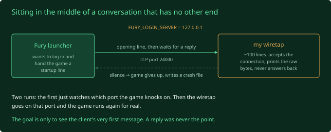
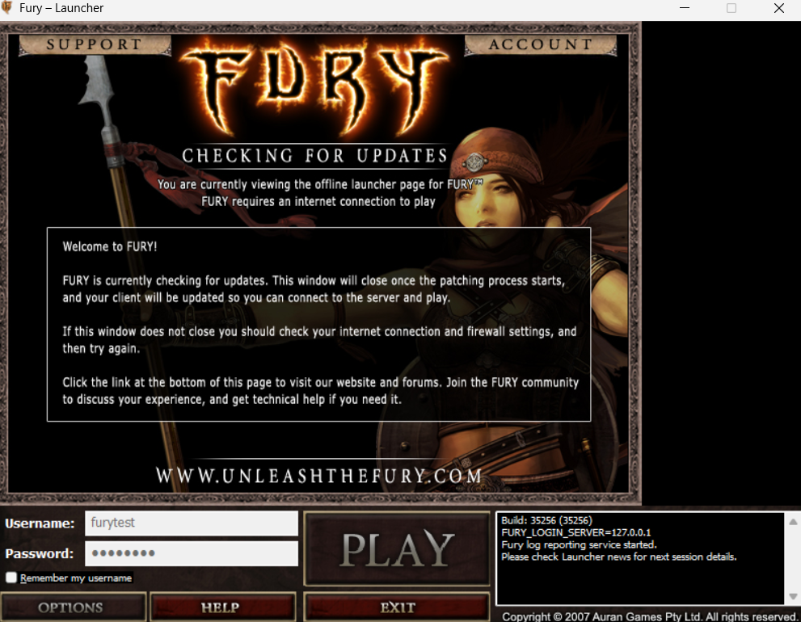
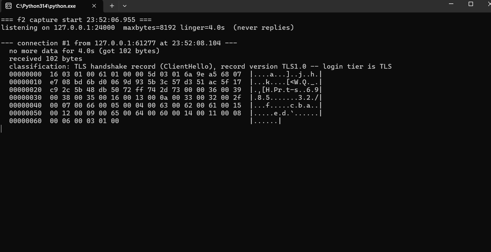
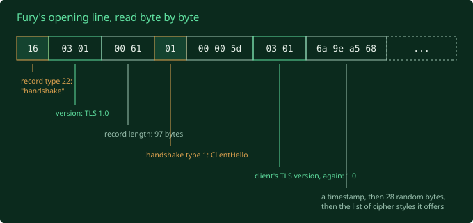
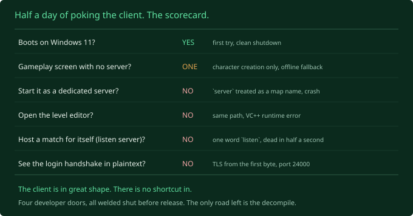

Every side door is welded shut, so now I'm at the part I actually care about.
Before I can rebuild the login server, I need to know what the client expects to
hear from one. The cleanest way to find out is to let the client try to connect,
and secretly write down everything it says.

## The wiretap

When you launch *Fury* normally, a small program called the launcher runs first.
Its job is to work out which login server to talk to, log you in, and then hand
the actual game a startup line telling it where to go. That's where the network
conversation begins.

The plan:

1. **Tell the game the login server is my own PC.** The launcher checks a few
   "environment variables" when it starts, named settings the operating system
   hands a program. One of them, `FURY_LOGIN_SERVER`, overrides the login server
   address. I set it to `127.0.0.1`, the universal "this same computer" address.
2. **Put nothing there but a wiretap.** About a hundred lines of code that accepts
   a connection and prints the raw bytes it receives. It never answers back. A
   listening device, not a server.
3. **Launch the game and watch.** It connects expecting a real login server, says
   its opening line, and my program writes it down. The game waits for a reply,
   gets nothing, gives up. Fine. I already got what I wanted.

One snag first: `FURY_LOGIN_SERVER` sets the *address*, not the *port*, the
numbered door on my PC it knocks on. So the first run just watched which door it
tried. Answer in about a second: **port 24000**.

[SIDE NOTE] the launcher also quietly fired off a second connection, over plain
web traffic, to the *real* `login.unleashthefury.com`. That domain has been dead
since 2008, right? Except it still resolves, to a live server, that answered. I
don't know what's there or who put it there. Probably a leftover "any news for
the launcher?" check. Written down to chase later, but, yea. Spooky.

## What it said

I put the wiretap on port 24000, launched the game, and this is the first thing
*Fury* said:

That first byte, `16`, and the `03 01` right after it, are a dead giveaway. This
is **TLS**, the thing the little padlock in your browser means. It's how two
computers agree on a shared secret and then talk in a code only they can read.
The "s" in "https".

So the login server doesn't speak anything I can just watch and learn. The moment
the connection opens, the client goes straight into "let's set up encryption"
mode. What I caught is its opening move, called a ClientHello: "hi, here's who I
am, here's the time, and here's every secret code style I know, pick one".

I can even read the age off it. The list of code styles it offers is a very 2007
list. A pile of them were considered fine then and are considered broken now,
including some deliberately weak "export" ones from the era when the US
government restricted strong encryption. It's like opening a drawer and finding a
Nokia 3310. Still works. Please don't do your banking on it.

The connection then died, because my wiretap sat there like a brick instead of
doing the encryption dance back.

## The good news hiding in the bad news

- **The login server is encrypted from the very first byte.** To rebuild login
  I'll have to stand up my own encryption endpoint with its own certificate, and
  only then do I get to see the actual login conversation.
- **But it's *standard* encryption, not a custom scramble.** I was bracing for
  some bespoke Auran in house obfuscation. It's not that. It's bog standard TLS,
  just old. Standard means standard tools.

The thing I still don't know: the client ships with a certificate of its own
(`trusted.crt`, sitting in `Binaries/`). When I put up a homemade one, will it
check against that and refuse? If so, that's a whole extra wall. Future me's
problem.

## The scorecard

That's the end of the poking phase. Half a day, seven experiments, one line
each:

The client is in great shape, better than it has any right to be. And there is no
shortcut in. So the next stretch is the slow one I was trying to avoid: take the
game's compiled script, turn it back into readable code, and read how its server
was built. See you in the code.
