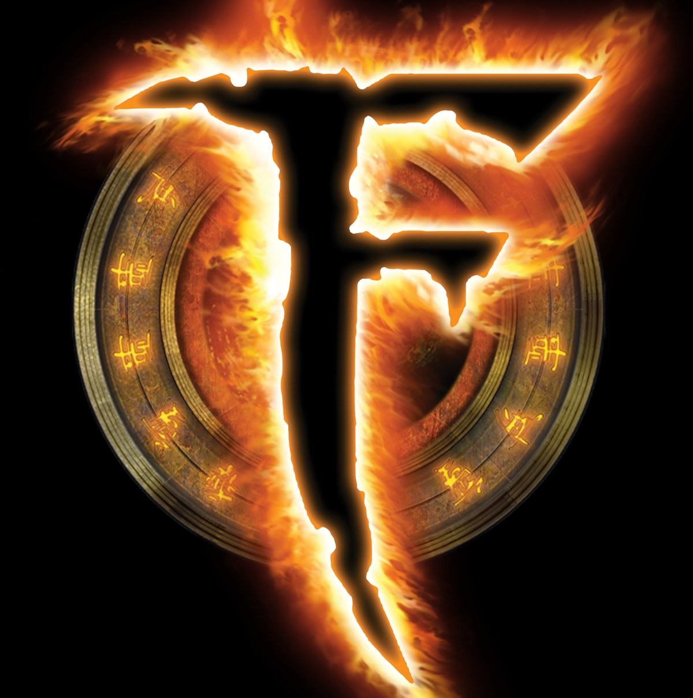
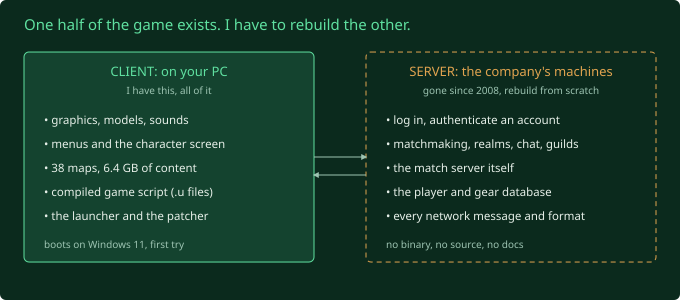

## What was Fury?

Fury was a massively ambitious PvP MMO built by the Brisbane-based studio, Auran, on Unreal Engine 3 (UE3), released in October 2007. It threw out questing, mob grinding, and most of the usual MMO stuff, and pared it back to pure PvP skill, gear rewards, and a classless skill system. It shut down less than a year after its release, in late 2008.

The devs, around 70 of them, put a huge amount of work into getting it out the door. Auran was one of the first independent studios to license UE3, which was bleeding-edge tech at the time. The goal was fast, low-latency, real-time combat where you could pit your reactions against another player, all running on an engine Epic Games hadn't even finished yet.

It cost around $15 million AUD to build, which made it Australia's most expensive game at the time. The money was an unusual mix: Auran's own cash, millions from the Asian tech giant CDC Games China (more on them later, as they heavily influenced the project), and a distribution deal with the US publisher Gamecock Media Group.

Before I started this, I assumed UE3 was a natural fit for an action game like this. Reading through its dev history changed my mind. UE3 was built for single-player games and arena shooters like Gears of War, and it was missing almost every core system you need to run an MMO. Looking back it seems like a wild choice of engine, but hats off to the devs for making it work haha. They had to do some serious middleware surgery just to get UE3 to do what they wanted. All up I think it took about 3 years of grinding to drag the game across the finish line.

## Why this project

Yeah so I mean, I love slightly older games. I usually play 2000s era RPG games like Dungeon Siege but seeing this game on the shelf at Noel Leemings when I was like 15, I knew I had to have it. Bought it, installed it, but the game had already been shut down for a while at that point so that was the end of that. But then....

I stumbled onto a full client install from years ago. That's all I have. No server files, no source code, just the original client and whatever shipped inside it. I wanted to see how far reverse-engineering could actually take me toward getting it playable again. I'm at a distinct disadvantage, having never played it despite my best efforts back in 2007. So decompiling the code and trying to attribute combat spells or features to the correct line will be absolutely tough, only being able to rely on the material I have in front of me. 

I'm treating this as a structured way to level up real engineering skills like networking, reading unfamiliar code, and system design. Whatever happens with the game itself, the process is the main point for me.

It's also obscure enough that there's basically no preservation or private-server community around it, unlike the bigger dead MMOs. As far as I can tell, nobody has ever tried reviving Fury. Sheesh. That empty void is a big part of why it's exciting.

One thing up front: I'll use AI for a lot of this. The way I embrace that without feeling helpless is realising that if this project has enough depth to it, I'll absolutely still be involved and not just the passenger. More on that in a later post, because it's an interesting topic.

## What's actually in the client

After digging through the install, there's quite a bit to work with:

- `.upk` files: standard Unreal package files with models, textures, and sounds.
- A `ScriptFinalRelease` folder full of `.u` files: compiled UnrealScript bytecode. Alongside the stock engine packages there are the custom ones: `GOGame.u` (which looks like it holds most of the game logic), plus `GOAI.u`, `GOEffect.u`, `GOGameType.u` and a handful more.

UnrealScript compiles down to bytecode rather than native machine code, so tools like UE Explorer can decompile it back into fairly readable source, with classes, functions, and state machines mostly intact. That's a much better starting point than trying to reverse-engineer raw compiled C++ binaries. See the [glossary](/glossary/) for a deeper look at how that works.

## What I don't have

The catch is the entire backend. No server binary, no network protocol docs, no live traffic captures, no auth system, no database schema. Every bit of server logic has to be built from scratch, with the decompiled client code as a reference rather than something I can copy-paste.

## The plan, roughly

1. Decompile and catalog the gameplay logic inside the `.u` files
2. Design and build a new server architecture around that logic
3. Reverse-engineer the network protocol by pointing the real client at my own local server
4. Build out auth, account management, and matchmaking backends
5. Get an actual client to log in, spawn in, and play

Step 3 is the biggest unknown, since there's no live server left to sniff packets from, so expect a lot of trial and error. Screw it, let's see how far we get.
